# Collaborative Project Management (Kanban in Forgejo) 

## **What tools can i use ?**

Let's say you have a project with too many todolists for you to complete in one month like in our example from this [previous tutorial](../microworkflow/index.md). While this kind of todolist organisation may work for individual work, this may not be ideal for collaborative work, where let's say you have 10 people that want to work on your project.

Rather than literally sending them your todo list text files over chat, you guessed it, you need a better, more serious solution. If you are familliar with Git (which is a distributed version control system, used to track versions of files), you may be thinking Github already, it is the biggest service for hosting open source code online, [but the problem is that it was acquired by Microsoft in 2018.](https://github.blog/news-insights/company-news/github-and-microsoft/) So if you're like me and you don't want your repositories taken down whenever microsoft feels like it (like what happened to [Tornadocash](https://www.eff.org/deeplinks/2023/04/update-tornado-cash?language=el)), you need to put your repositories elsewhere:

Therefore to stay in line with our OPSEC requirements we need to use the FOSS, self-hostable alternative: Forgejo. We'll use our [Forgejo instance](http://gdatura24gtdy23lxd7ht3xzx6mi7mdlkabpvuefhrjn4t5jduviw5ad.onion/) for this tutorial, but you can do the same on your own Forgejo instance (here's the [tutorial](../../opsec/forgejo-anon/index.md) on how to setup your own .onion Forgejo instance).

## **Creating the repository**

First you need to register (feel free to use a throwaway email if you want), and then you need to create your first repository:

 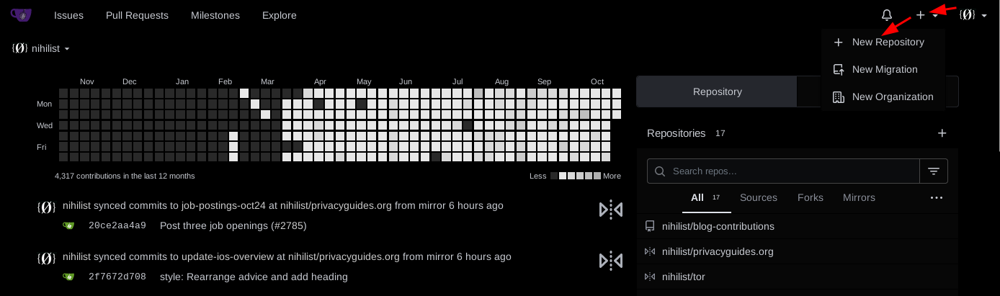

Now here we create our collaborative project repository:

Then to you can create your readme file and the first commit in it, with the tutorial that's showcased:

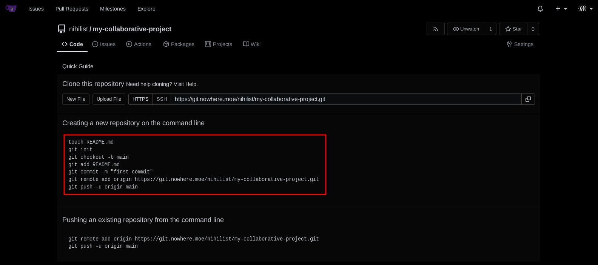
    
    
    [ mainpc ] [ /dev/pts/13 ] [~/Documents]
    → mkdir my-collaborative-project
    
    [ mainpc ] [ /dev/pts/13 ] [~/Documents]
    → cd my-collaborative-project
    
    [ mainpc ] [ /dev/pts/13 ] [~/Documents/my-collaborative-project]
    → vim README.md
    
    [ mainpc ] [ /dev/pts/13 ] [~/Documents/my-collaborative-project]
    → cat README.md
    welcome to my collaborative project!
    	
    [ mainpc ] [ /dev/pts/13 ] [~/Documents/my-collaborative-project]
    → git init
    git checkout -b main
    git add README.md
    git commit -m "first commit"
    git remote add origin http://gdatura24gtdy23lxd7ht3xzx6mi7mdlkabpvuefhrjn4t5jduviw5ad.onion/nihilist/my-collaborative-project.git
    git push -u origin main
    hint: Using 'master' as the name for the initial branch. This default branch name
    hint: is subject to change. To configure the initial branch name to use in all
    hint: of your new repositories, which will suppress this warning, call:
    hint:
    hint:   git config --global init.defaultBranch 
    hint:
    hint: Names commonly chosen instead of 'master' are 'main', 'trunk' and
    hint: 'development'. The just-created branch can be renamed via this command:
    hint:
    hint:   git branch -m 
    Initialized empty Git repository in /home/nihilist/Documents/my-collaborative-project/.git/
    Switched to a new branch 'main'
    [main (root-commit) c567662] first commit
     1 file changed, 1 insertion(+)
     create mode 100644 README.md
    
    **Username for 'http://gdatura24gtdy23lxd7ht3xzx6mi7mdlkabpvuefhrjn4t5jduviw5ad.onion': nihilist
    Password for 'https://nihilist@gdatura24gtdy23lxd7ht3xzx6mi7mdlkabpvuefhrjn4t5jduviw5ad.onion':yourpassword**
    
    Enumerating objects: 3, done.
    Counting objects: 100% (3/3), done.
    Writing objects: 100% (3/3), 250 bytes | 250.00 KiB/s, done.
    Total 3 (delta 0), reused 0 (delta 0), pack-reused 0
    remote: . Processing 1 references
    remote: Processed 1 references in total
    To http://gdatura24gtdy23lxd7ht3xzx6mi7mdlkabpvuefhrjn4t5jduviw5ad.onion/nihilist/my-collaborative-project.git
     * [new branch]      main -> main
    branch 'main' set up to track 'origin/main'.
    
    

And from here as you can see, we have our README.md file thats visible from the repository:

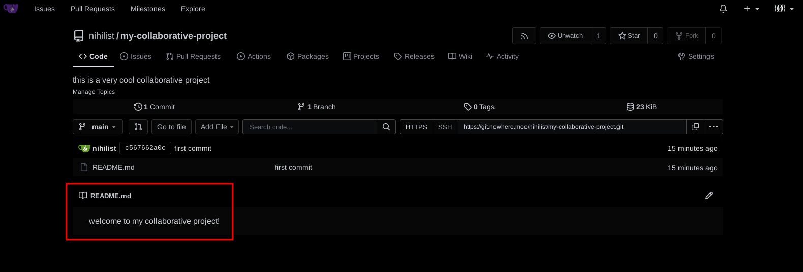

Now let's say you have multiple todolists like we previously saw (just exclude the "master todolist" (titled 0,txt) that is to be considered an index to list the other todolists), you can consider those as "issues" from now on.
    
    
    [ mainpc ] [ /dev/pts/4 ] [~/todo lists]
    → cat 0.txt
    -Project Opsec (243 -> 211)
            -Privacy Category (2112)
                    **-Linux Host OS Task (21121.txt)**
            -Anonymity Category (2113)
            -Deniability Category (2114)
                    **-Veracrypt Task (21121 -> 21141.txt)**
                    **-Deniable VMs Task (21141 -> 21142.txt)**
    
    -Project Infrastructure (24)
            **-setup VPS  (241)**
            **-create the blog (241 -> 242)**
            **-officially announce the blog is accepting contributions (242 -> 243.txt)**
    
    

Below you have the example of a detailed todolist:
    
    
    [ mainpc ] [ /dev/pts/4 ] [~/todo lists]
    → cat 21142.txt
    -Deniable VMs todo list, not Task (21141 -> 21142)
            -To be explained:
                    - What is the usecase ?
                    - What tools are going to be used ?
                    - Why do we need Veracrypt ?
                    - Why do we need Whonix ?
            -To be showcased:
                    - How to create the hidden volume
                    - How to put the Whonix VM inside the hidden volume
                    - How to use the emergency shutdown script as a non-root user
                    - How to start the emergency shutdown script with a cinnamon keyboard shortcut
    
    

so let's create an issue for it in Forgejo:

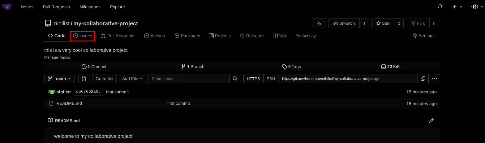 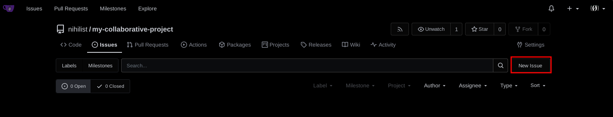

In the title of the issue i like to mention the Category of the issue, followed by the todolist title, and in the description i mention the list of tasks that must be done to complete the issue:

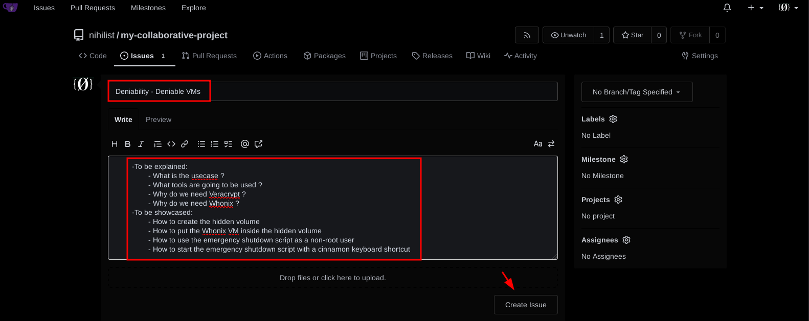

And from there, you can create the rest of the issues for your project aswell in the same way, and see them listed here:

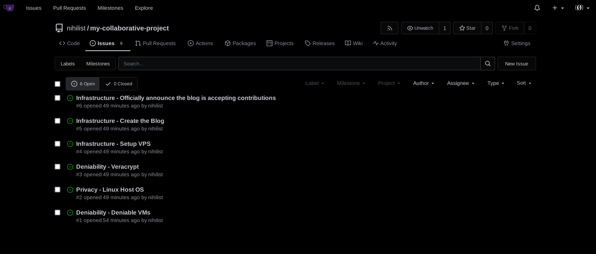

## **Kanban Project Management**

Now when you have alot of issues (let's say over a 100 issues) it's going to be hard to keep track of all of them by default. To help with the status tracking, you can setup a kanban project board:

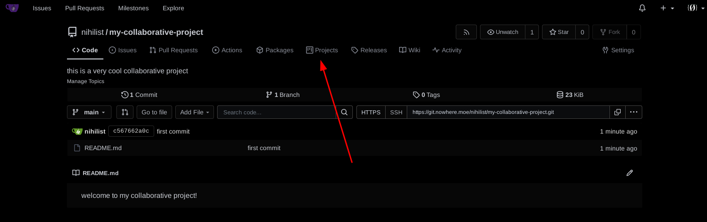 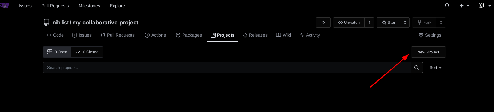 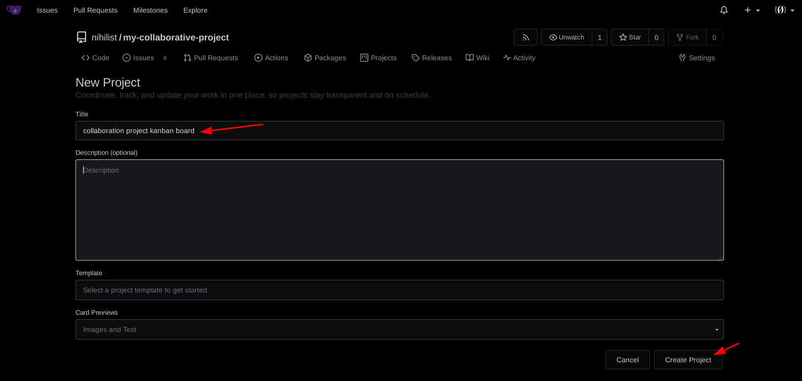 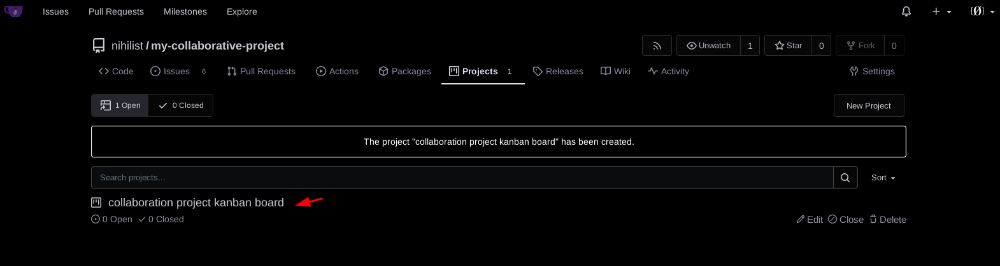 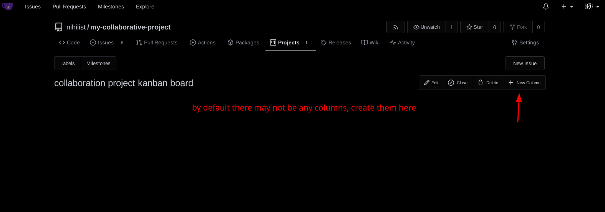 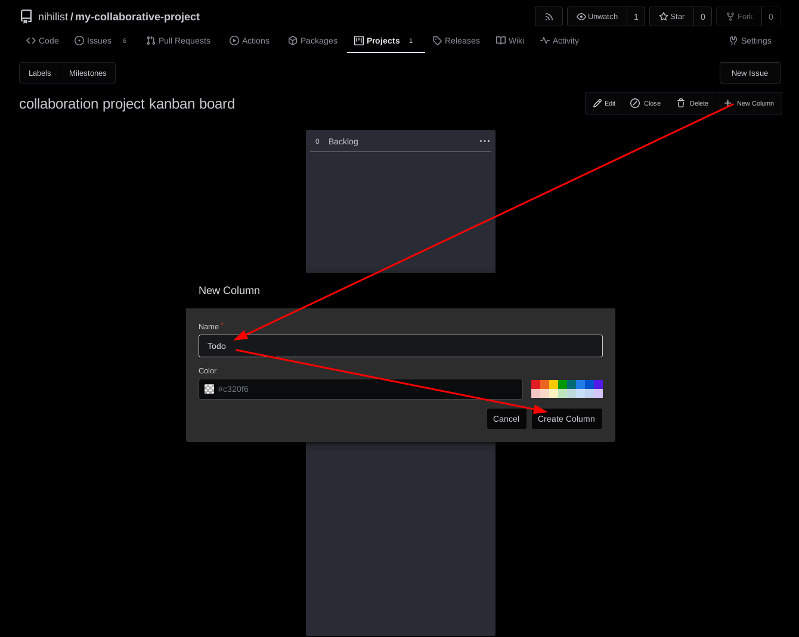 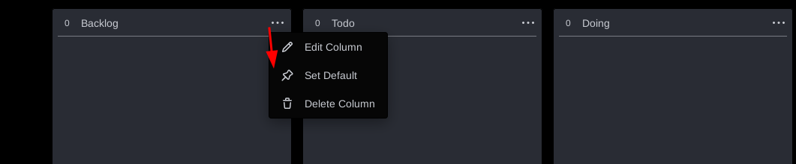

The default, and most popular Kanban setup is by having the **Backlog / Todo / Doing / Done** columns.

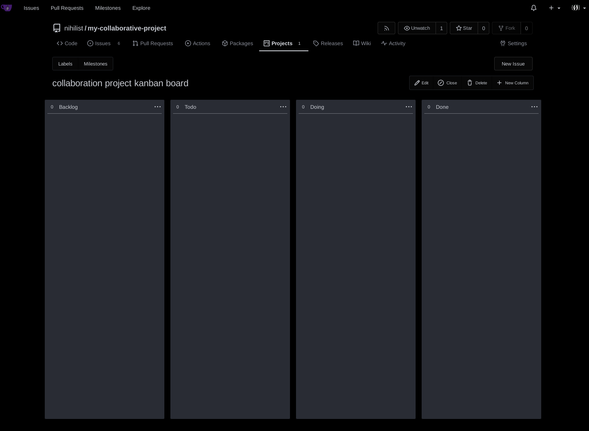

Now to make sure your issues appear in your project board, you need to make sure that they are in the project board like so:

once you've made sure all of your issues are in your project, you can drag and drop them in either column to easily keep track of their status:

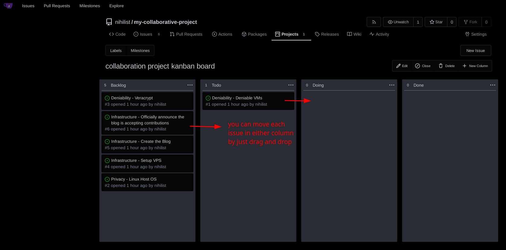

You can change the default columns **(backlog / todo / doing / done)** to adapt it to your project, for my projects for instance i like to have these columns: **(to be brainstormed, to be assigned, assigned (doing), to be reviewed, completed)** :

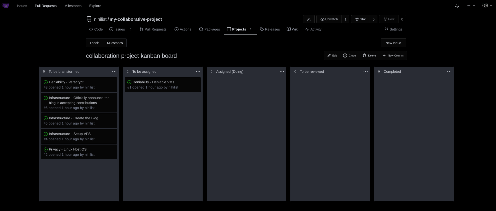

Now you can customize your issues further with labels. For instance i like to have labels describing the difficulty of each issue: **"Simple / Doable / Complex"** and labels to describe if the issue is supposed to be an **improvement** , or if it is under **external review**. you can create the labels here:

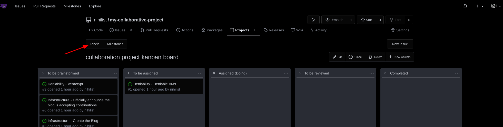 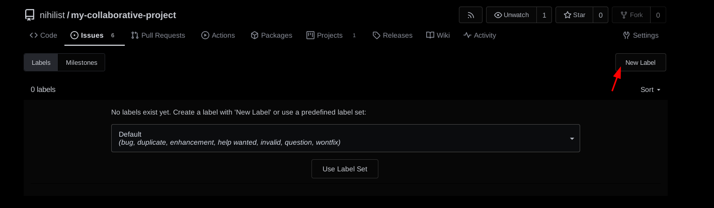 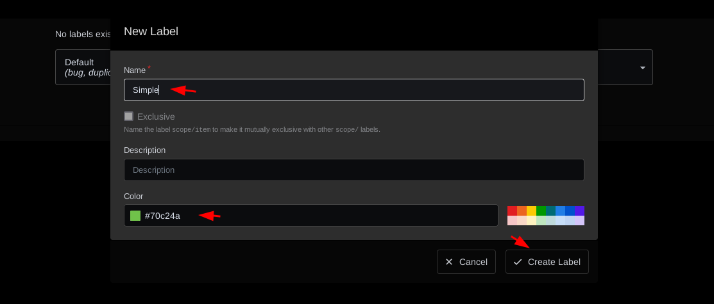 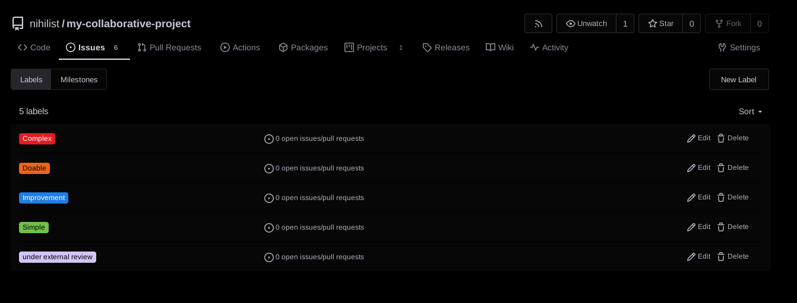 

once the labels are added to each issue, you can see the overall progress of the project:

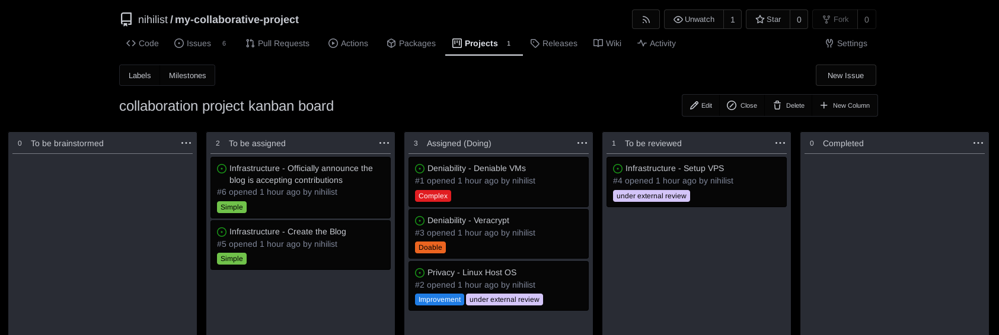

Now this is a small example, but if you want to see a real sized-project, check out the Opsec project i have on this [project board](http://gdatura24gtdy23lxd7ht3xzx6mi7mdlkabpvuefhrjn4t5jduviw5ad.onion/nihilist/the-opsec-bible/projects/1): 

And that's it! now you know how to handle a long-term large project. If you want to check out how i welcome collaborations on my Opsec Bible, check out the tutorial i made [here](../../opsec/contribute/index.md).

