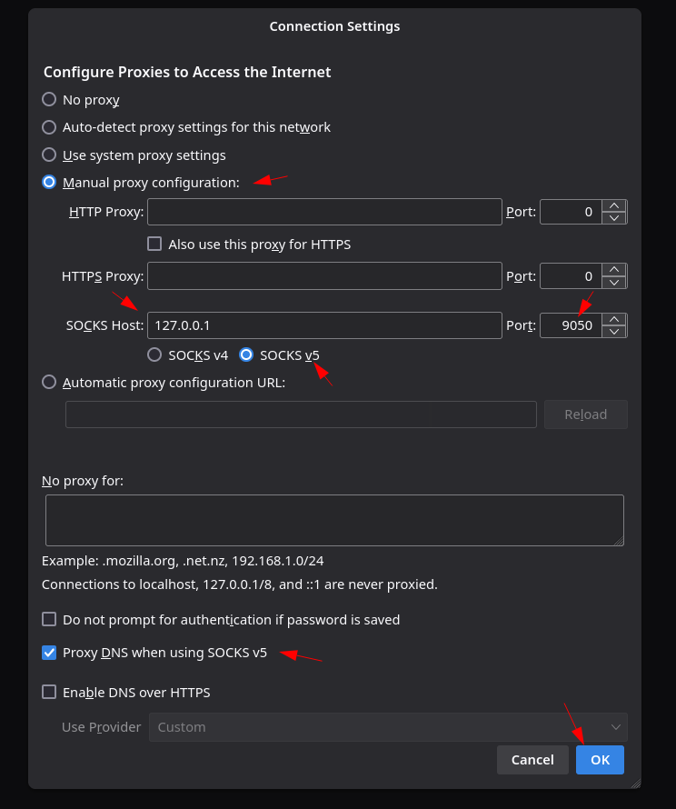
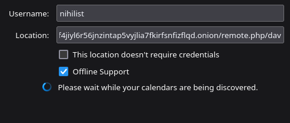
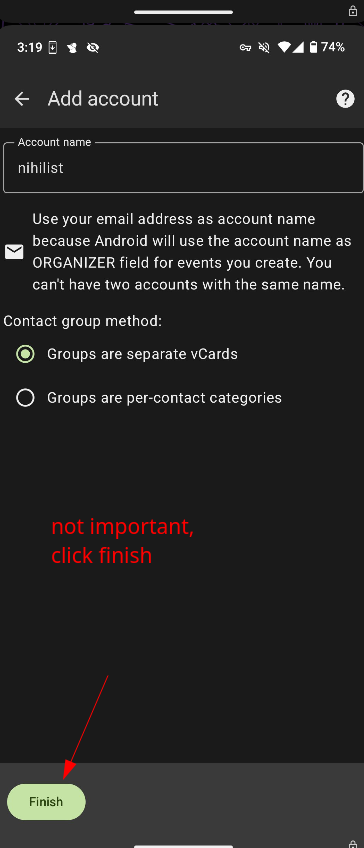
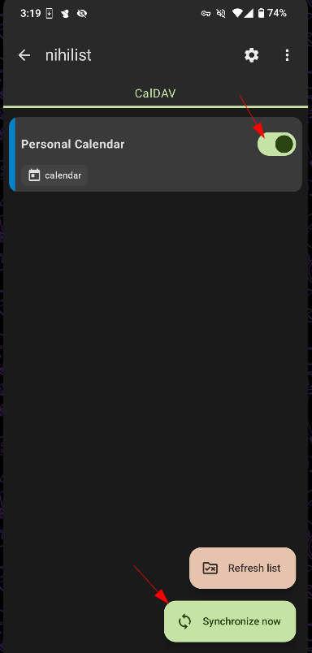

# Macro Time Management: Project Priorization and Calendar Scheduling 

## **Project Priorization**

Now that we have our [list of projects](../macroworkflow/index.md), we have to allocate the time to work on each projects. It's a matter of finding the right balance, don't just allocate 100% of your free time to one project, and 100% of your work time to an other project. You need to split it correctly. Let's check out how i split my time for each project.
    
    
    For the world (1)					(95% of Freetime)
    	-Blog (11)
    		-Project Opsec(111)				(50% of Free time)
    		-Project Productivity (112)			(25% of Free time)
    	-Fediverse (12)						(5% of Free time)
    	-Privacy Front-ends(13)					(5% of Free time)
    		
    For yourself (2)
    	-Life (21)					(5% of Freetime)
    		-Relationships (212)				(4% of Free time)
    		-Apartment / House (211)			(1% of Free time)
    
    	-Work (23)					(100% of Work time)
    		-Work Project A (231)				(50% of Work time)
    		-Work Project B (232)				(50% of Work time)
    		-Work Project C (231 + 232 -> 233)	
    
    

Here as you can see, i have decided to reduce the my freetime to just 5% of the things i do for myself, the remaining 95% of things i do during my free time are for the world, as i know that these are going to be the most fulfilling things i can do. As we have explained [previously](../rightthing/index.md), **you need to priorise projects, based on which one matters most to you** , and as i have ranked each project from most important (at the top) to least important (at the bottom) you can see how i allocated the time i spend for each accordingly.

**For Work,** the priorisation of projects is different, as you're not supposed to prefer a project over another, here you just need to **complete the projects in the correct order.** As you can see Project Z depends on project X and Y to be started, therefore I split my work-time in 2, half the time is dedicated to project X, and the other half of the time is dedicated to project Y.

The next week will have a different time allocation if projects X and Y are completed. Unless if there are more projects added to the list, then it will be project Z taking up 100% of the time afterward.

## **Calendar Scheduling**

For calendars, to make it simple, i recommend using thunderbird:
    
    
    [ mainpc ] [ /dev/pts/13 ] [~/Nextcloud/blog]
    → sudo apt install thunderbird -y
    
    [ mainpc ] [ /dev/pts/13 ] [~/Nextcloud/blog]
    → thunderbird
    	
    

First thing we need to do after installing the app is enable the socks5 proxying, so that the app is able to resolve .onion domains:

 

Now that thunderbird has the socks5 proxying enabled, it is now able to sync with .onion Caldav calendars, so let's use the calendar that comes preinstalled with with [Nextcloud](../../opsec/nextcloud/index.md):

     

Now from here, you can schedule your personal time events in the "Personal" calendar, just do "Ctrl+I" to schedule an event:

In this case, we're doing a one-time event (going to the restaurant):

But in the case where you have a recurrent event (like renewing your [mullvad VPN](../../opsec/vpn/index.md) subscription): you can schedule a recurring event like so:

To schedule events on the work calendars you can simply switch the calendar when creating a new event:

Then, as we also want to create "Default" tasks for entire weeks, we can just create an event that is an "All day event", starting from Monday, and ending on Sunday:

And you can also do the same for your work calendar:

So you now get the following result:

For each week, you have a "default" work and personal project to work on whenever you have time (the cup is filled with water), and in it you have your one-time or recurrent events aswell (the marbles in your cup).

Here as you can see on the week view, you have your default tasks on the top, and during the day you have your events.

## **Mobile Calendar Scheduling**

First, you need the Davx5 application from the Fdroid store on your [grapheneOS phone](../../opsec/graphene/index.md), that'll help us sync with the onion calendar we have on our .onion nextcloud instance:

           

Now that the Caldav nextcloud calendar is synchronized locally, we can display it using Etar Calendar:

   

Now that it is installed, we can install the widget to view our calendar from our phone directly:

  

And that's it! you now have your own .onion caldav calendar synchronized and displayed on your phone aswell.

