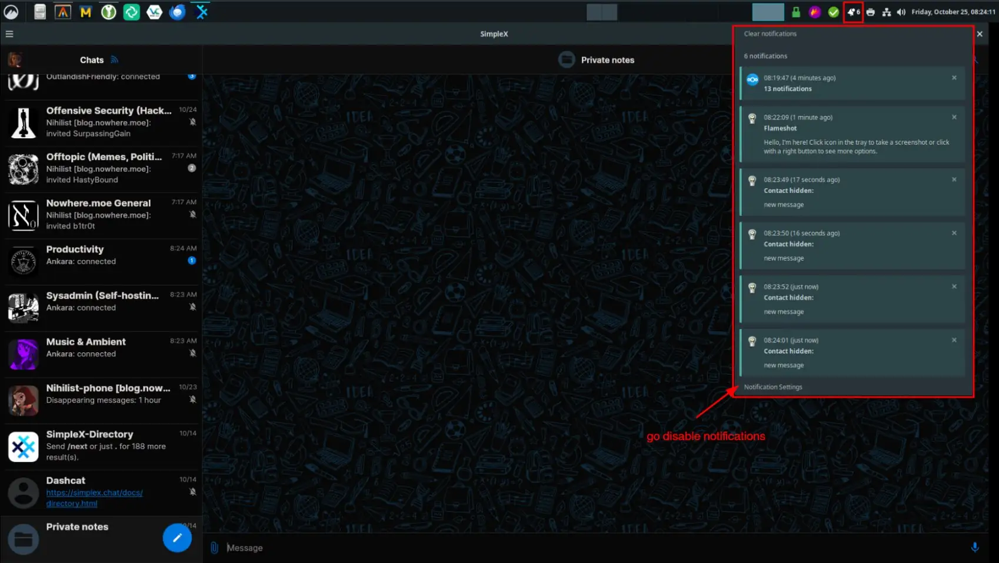
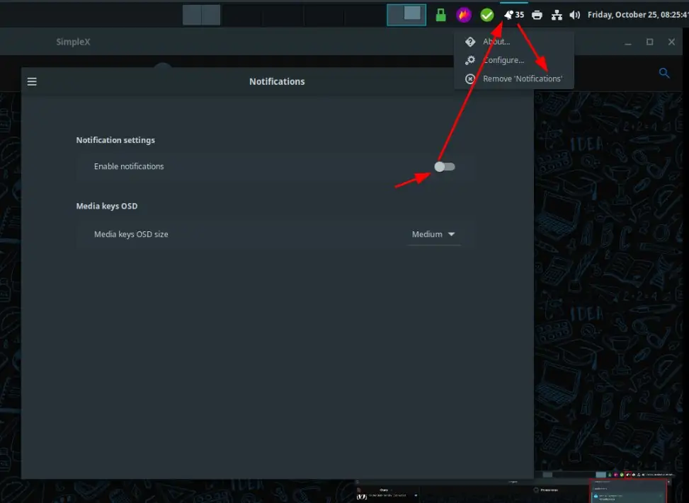
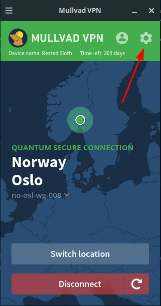
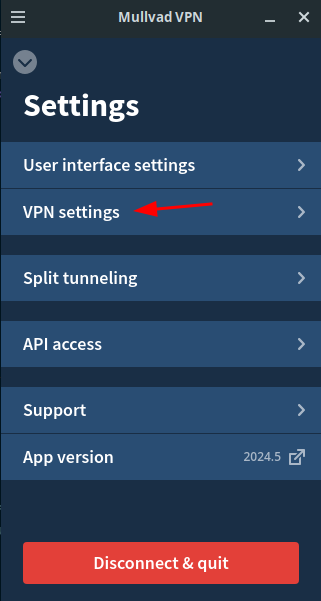
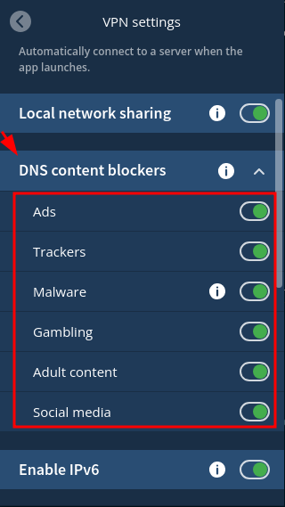
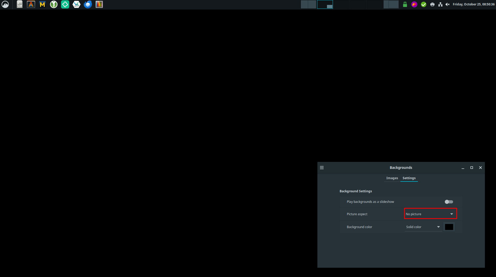
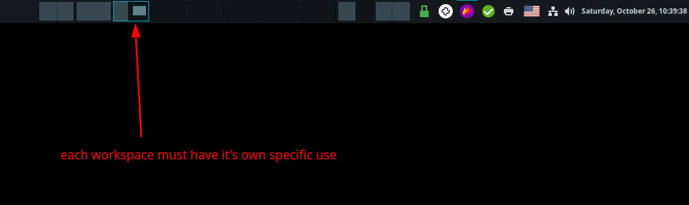

# Workspace Preparation: Focus Optimisation

## **Why is this important ?**

Your brain has a reward system (which is a collection of brain structures and neural pathways that are responsible for reward-related cognition), that essentially makes you feel good upon encountering certain stimuli. The problem is that your brain may give you the reward not for you actually achieving your work, but rather it may reward you along the way for totally unrelated things.

This ties into the "Carrot & Stick" discipline method, **you need to be very careful where is the positive outcome at (where the carrot is)** , and where the negative outcome is (where the stick is)

An example of this would be that you have work to do on some project, but you don't want to. And since you have all your video games on the same computer, you might be tempted to just play a video game because the reward is immediate, and it feels good immediately. **All that happened here is that the carrot has changed shape, it is no longer the accomplished work, but rather it has become just playing a videogame.**

You need to **make sure that the carrot stays the same,** from start to finish, and to do so you better make sure that nothing stands in the way of your work.

Over time you may become completely de-sensitivized after indulging into too much stimuli (video games, sex, substance abuse, etc), so much so that nothing may feel rewarding anymore. and definitely not accomplishing any meaningful work.

You need to re-sensitivize yourself, by cutting short all of that excessive stimuli, so that the carrot may take the correct shape. **For instance my carrot is having positive feedback from my blogposts, and the donations i recieve on my monero wallet.** That is my reward for the work, but as you will see, the carrot can have many shapes, and some are definitely not trivial to notice.

## **Where are you wasting mental energy ?**

Let's say you decide to follow my [morning routine](../morningroutine/index.md), it's saturday, 7 AM, you're freshly out of your cold shower feeling refreshed and full of energy. You've decided that today you're going to work on your personal projects until you fall asleep in the night. Great, the destination has been decided. What can go wrong along the way ? Or in other words, what are the potential distractions and blockers to your focus ?

  1. You may have a **dirty** room with a **messy** desk

  2. It may be **noisy** around your workstation, and the random noises may distract you

  3. you may have left the default **notifications** on that are sent from the chat applications on your computer

  4. the wallpaper you have has **intricate imagery** and good looking, which makes you stop every now and then to look at it

  5. you put on some **intricate music** that can be overwhelming, which derails your thinking to focus on the music, rather than on the work

  6. you may have another screen with **videos or streams** playing

All of those are potential sources of distraction, which can all be obstacles to your focus and work. Therefore we need to do something about it, before we start working.

## **IRL measures to take**

First thing you need to do is clean up your room, and especially your desk. It should have your keyboard, your mouse, your monitor(s) and it must be well cable-managed.

While it may not be obvious if you got used to working in a messy area, trust me it will make all the difference in the world once you cleaned it up, and keep it clean. **You can't just appreciate the subtler parts of a holy temple by throwing shit at the entrance** , every day you must keep it clean, free of distractions.

Next is how noisy is it in your room ? Do you have noisy neighbors ? 

To fix that you can either go and yell at your neighbors, but more simply just get yourself **active (not passive) noise-cancelling headphones**. they will suppress the potentially distracting noises for you.

Now that you've taken care of the meatspace, it's time to take care of the digital side of things.

## **Digital measures to take**

First easy thing you can care of are the notifications on your computer.

 

Just disable them, systemwide, as most likely none of them are truly urgent. If there is a place where you can expect to get urgent notifications (like your mails for example), keep it open on a workspace and periodically check for new alerts whenever you feel like it.

The next thing you can do is block websites that you naturally go to, to distract yourself. to do so we can block those websites from [mullvad VPN](../../opsec/vpn/index.md) directly: 

  

Thanks to that, you can't just go on high-stimulus websites anymore like social media or gambling.

Now if there are other websites that didn't get blocked by mullvad, you can mention them from the hosts file in your computer:
    
    
    [ mainpc ] [ /dev/pts/3 ] [blog/productivity/mentalopti]
    → sudo vim /etc/hosts
    
    [ mainpc ] [ /dev/pts/3 ] [blog/productivity/mentalopti]
    → cat /etc/hosts | grep youtube
    0.0.0.0 youtube.com www.youtube.com
    
    [ mainpc ] [ /dev/pts/3 ] [blog/productivity/mentalopti]
    → ping www.youtube.com
    PING youtube.com (127.0.0.1) 56(84) bytes of data.
    64 bytes from localhost (127.0.0.1): icmp_seq=1 ttl=64 time=0.112 ms
    64 bytes from localhost (127.0.0.1): icmp_seq=2 ttl=64 time=0.095 ms
    64 bytes from localhost (127.0.0.1): icmp_seq=3 ttl=64 time=0.090 ms
    
    

Then, you may have a very high-contrast wallpaper that may distract you:

So simply change it to no wallpaper, just pick a color and select "no picture":

Next, you may listen to some music while working, but here also you need to be careful if the music is very intricate with a high-stimuli potential. For instance you may be used to working with [high-stimulating music](https://radio.nowhere.moe/radio/cyberia.mp3), but these have the potential of wearing down your mental energy, causing you to get tired much more quickly, than with a [low-stimulus](https://radio.nowhere.moe/radio/psychedelia.mp3) music.

My preferred tracks for working would be [ambient tracks](https://radio.nowhere.moe/radio/focus.mp3) [[2]](https://radio.nowhere.moe/radio/meditation.mp3)[[3]](https://radio.nowhere.moe/radio/nihilism.mp3), not enough to distract me, and enough to feel like listening to something. One other option would be to work in total silence if you are able to focus in that scenario, but it depends on what you are used to.

And lastly, you don't want to do everything from one workspace, otherwise you're going to get lost preety quickly if you need to do planning, doing the work, reviewing the work, etc:

You need to use multiple workspaces:

For instance, i have 10 workspaces divided like so, based on the general workflow we highlighted in [this previous tutorial](../generalworkflow/index.md):

To make accessing each workspace easier and faster, i configured shortcuts:

 

So i can do **CTRL+ALT+3** to shift to my blog writing, and **CTRL+ALT+9** to shift to my keepassXC to copy the credentials i need to paste in workspace 3.

And that's it! Now [stop going around in circles](../opus-nihil/index.md), and get back to doing what truly matters to you!

## **Tiling Window Managers**

Tying back to the workspace management, you can have a tiling window manager where you can manage the applications you open and move around on your desktop using only the keyboard.

To achieve this i recommend using the i3 window manager like so:
    
    
    nothing@debian:~$ su -
    Password: 
    root@debian:~# apt install i3 -y
    
    

once installed, (since you are probably not already in i3, but rather in an other window manager like cinnamon) you can simply go back to the login screen by logging out or by running this command:
    
    
    root@debian:~# systemctl restart lightdm
    
    

`   

From there you can start to edit the i3 config from a terminal (that you open with the shortcut Win+ENTER):

    
    
    nothing@debian:~$ vim ~/.config/i3/config
    
    

From here you can customize just about anything you want, from the shortcuts, to the colors used and the apps that are launched upon startup. Here are the main shortcuts that you need to remember:
    
    
    #my Modkey is the windows key (Mod4), it's at the very top of my i3config file.
    
    #Change workspaces :
    -Mod+1234567890
    
    #Change focus to next window :
    -Mod+Arrow
    
    #KILL the window:
    -Mod+Shift+Q
    
    #Toggle Vertical/Horizontal layout :
    -Mod+V or H (and then move/create a window where you put the V/H mode)
    
    #Move window in the workspace :
    -Mod+Shift+Arrow
    
    #Move window to workspace:
    -Mod+Shift+12345647890
    
    #Create Terminal window:
    -Mod+Enter
    
    #open any application:
    -Mod+d 
    (type application name)
    ENTER
    
    #Toggle floating mode on a window:
    -Mod+Space
    
    #Enter resize mode:
    -Mod+R  
    -then Arrows to resize
    -then ESC to exit resize mode
    
    

## **My Productivity Setup**

I customized this quite a bit myself, while still trying to remain minimalistic about it, you can find my dotfiles [here](http://gdatura24gtdy23lxd7ht3xzx6mi7mdlkabpvuefhrjn4t5jduviw5ad.onion/nihilist/dotfiles). In order to get my customized setup quickly i have made those 2 scripts: 

First script to setup i3 and the GUI apps i want (drawio, torbrowser, mullvad-browser, simplex chat, keepassxc):
    
    
    nothing@debian:~$ su - 
    root@debian:~# usermod -aG sudo nothing
    root@debian:~# reboot now
    
    nothing@debian:~$ sudo apt install git tor torsocks -y
    nothing@debian:~$ torsocks git clone http://gdatura24gtdy23lxd7ht3xzx6mi7mdlkabpvuefhrjn4t5jduviw5ad.onion/nihilist/dotfiles
    nothing@debian:~$ cd dotfiles
    nothing@debian:~$ chmod +x ./kicksecuresetup.sh
    
    nothing@debian:~$ ./kicksecuresetup.sh
    (let it run, and put your sudo passwords when it asks for it)
    
    

And i have this other script here to setup my terminal how i want it to be with the CLI apps i use (zsh, tmux, ohmytmux, ranger, and vim):
    
    
    nothing@debian:~$ ./terminalsetup.sh
    (let it run too, and put your sudo passwords when it asks for it)
    
    

Do put your user's password whenever it asks for it, and once they finish running you can reboot your debian OS to see the changes:
    
    
    nothing@debian:~$ sudo reboot now
    
    

And then once it reboots you login as usual into i3, i3 will launch all the applications automatically by using the **~/.config/i3/startapps.sh script**. For me my apps i launch automatically are as follows:

 

On the first workspace: launching drawio to help me visualize what i envision for the projects i maintain

 

On the second workspace: launching the tor browser on Datura forgejo to help me plan the next issues for the projects

On the third workspace: launching thunderbird to help me schedule the work i need to do

On the fourth workspace: Launching Codium to write new content for the blog.

The rest of the workspaces are work-related, where i use the terminal alot, hence from a terminal window i need to remember the following tmux shorcuts:
    
    
    #enter tmux:
    tmux
    
    #CTRL+b is the default tmux keybind to start any tmux action.
    #to cancel it just press ESC
    
    #WINDOWS
        #Create a new window:
        CTRL+b c
    
        #kill current window:
        CTRL+b &
    
        #Rename Window
        Ctrl+B ,
    
        #Goto window:
        CTRL+b 123456789
    
        #Browse the tmux sessions (windows and panes)
        CTRL+b W
    
    #PANES (contained within windows) :
        #split vertically or horizontally  (this is creating panes basically):
        #CTRL+b " 
        #CTRL+b %
    
        #Change pane focus:
        CTRL+b Arrow
    
        #Cycle Panes:
        CTRL+B o
    
        #Cycle Move panes:
        CTRL+B CTRL+O
    
        #Move pane into new window:
        CTRL+B !
    
        #Resize Pane:
        CTRL+b CTRL+Arrow
    
        #close pane:
        CTRL+b x
    
        #display pane numbers:
        CTRL+b q
    
    #COPY AND PASTE
    CTRL+b [                (to enter copy mode, or PageUP to place the cursor farther up) 
    	-> and then just click and drag to whatever text you want to copy
    arrow keys              (to place the cursor where you need it (or PageUP/PageDN))
    CTRL+Space              (and then move the cursor to select the lines you need)
    CTRL+W                  (to copy your selection into the buffer)
    
    CTRL+SHIFT+V            (to paste your selection)
    SHIFT+insert            (to paste your selection)
    
    CTRL+B [ 
        then CTRL+S (Search Pattern downward)
        then Enter
        then hit n to cycle through the results
    
    CTRL+B [
        then CTRL+R (Search Pattern upward)
        then Enter
        then hit n to cycle through results
    
    CTRL+B f (find window based on what's displayed in it)
    
    

From i3, if you want you can also mute all notifications by adding the following dunst lines in startapps.sh:
    
    
    [ Mainpc-PrivateVM-Debian12 ] [ /dev/pts/38 ] [~]
    → cat ~/.config/i3/startapps.sh
    #!/bin/bash
    
    # DISABLE NOTIFICATIONS:
    /usr/bin/dunst
    /usr/bin/dunstctl set-paused true
    sleep 1
    
    #Start apps:
    [...]
    
    

And there you have the last 2 workspaces, one for payments and accesses, and the last one being for distractions:

 

And that's it! you now have a completely tuned-up productivity setup like mine.

