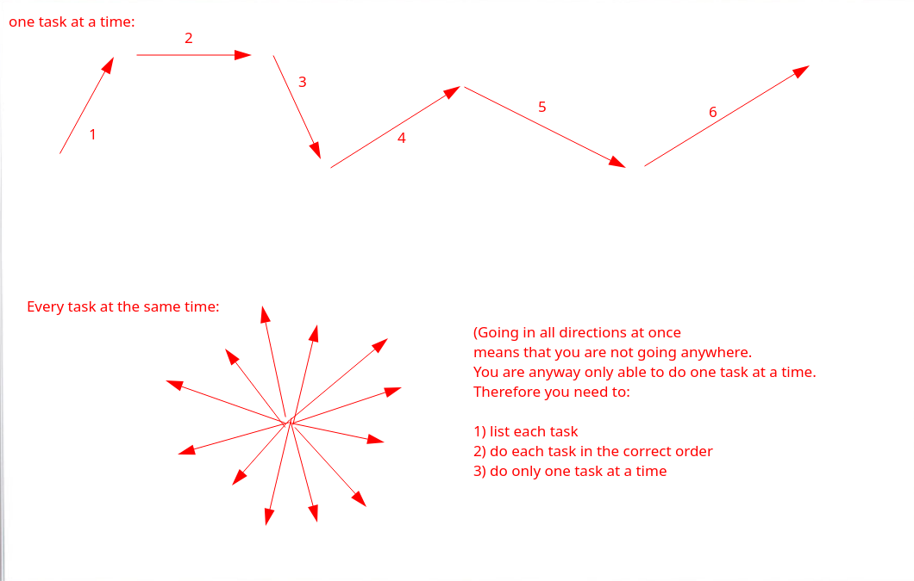

# Micro Workflow: Todo Listing, Contextualizing, and Ordering Tasks 

In this tutorial we're going to cover how to write todo lists:

This is essential because you are only able to focus on one thing at a time. You anyway have to do one task at a time, that's why you need to list each task, make sure that you put an order to those tasks, and make sure that you only do one at a time.

## **Todo Listing**

As a continuation of our [previous tutorial on macro workflow](../macroworkflow/index.md), to write your todo list effectively, you need to contextualize it in a particular project (or topic) list the tasks, label them, and note down on what other task do they depend on.
    
    
    -Project Opsec (243 -> 211)
    	-Privacy Category (2112)
    		-Linux Host OS Task (21121)
    	-Anonymity Category (2113)
    	-Deniability Category (2114)
    		-Veracrypt Task (21121 -> 21141)
    		-Deniable VMs Task (21141 -> 21142)
    
    -Project Infrastructure (24)
    	-setup VPS  (241)
    	-create the blog (241 -> 242)
    	-officially announce the blog is accepting contributions (242 -> 243)
    	
    

As you can see here, we have our 2 Projects: Infrastructure and Opsec, with tasks under each that are labeled, this is for us to be able to contextualize them more easily.

And with the label at the end, we also write which other task must be completed before starting each task, if there are any.

## **What happens when the todo list gets too big ?**

Following this way of working is nice at first, but when the todo list gets too big to be done in one day or week, it's going to feel very overwhelming. For example if i were to detail what i have to do for the Deniable VMs tutorial
    
    
    -Project Opsec (243 -> 211)
    	-Deniability Category (2114)
    		-Deniable VMs **todo list, not Task** (21141 -> 21142)
    			-To be explained:
    				- What is the usecase ?
    				- What tools are going to be used ?
    				- Why do we need Veracrypt ? 
    				- Why do we need Whonix ?
    			-To be showcased:
    				- How to create the hidden volume
    				- How to put the Whonix VM inside the hidden volume
    				- How to use the emergency shutdown script as a non-root user
    				- How to start the emergency shutdown script with a cinnamon keyboard shortcut
    	
    

In short, when each Task is starting to become a todo list of it's own, you need to treat it not as a task, but as a separate todo list.

## **How to handle multiple todo lists**

So to have multiple todolists, we're going to have multiple files:
    
    
    [ mainpc ] [ /dev/pts/4 ] [~/todo lists]
    → tree .
    .
    ├── 0.txt
    ├── 21141.txt
    ├── 21142.txt
    └── 243.txt
    
    1 directory, 4 files
    
    

as you can see, the smaller the number, the higher level we have for the todo list. **The master todolist is the 0.txt text file** , it references the projects and labels them, and also labels each todo list underneath.
    
    
    [ mainpc ] [ /dev/pts/4 ] [~/todo lists]
    → cat 0.txt
    -Project Opsec (243 -> 211)
            -Privacy Category (2112)
                    -Linux Host OS Task (21121)
            -Anonymity Category (2113)
            -Deniability Category (2114)
                    -Veracrypt Task (21121 -> 21141.txt)
                    -Deniable VMs Task (21141 -> 21142.txt)
    
    -Project Infrastructure (24)
            -setup VPS  (241)
            -create the blog (241 -> 242)
            -officially announce the blog is accepting contributions (242 -> 243.txt)
    
    

Now we have the todolist "Deniable VMs" labeled 21142, so we have the **21142.txt textfile** containing the todolist accordingly:
    
    
    [ mainpc ] [ /dev/pts/4 ] [~/todo lists]
    → cat 21142.txt
    -Deniable VMs todo list, not Task (21141 -> 21142)
            -To be explained:
                    - What is the usecase ?
                    - What tools are going to be used ?
                    - Why do we need Veracrypt ?
                    - Why do we need Whonix ?
            -To be showcased:
                    - How to create the hidden volume
                    - How to put the Whonix VM inside the hidden volume
                    - How to use the emergency shutdown script as a non-root user
                    - How to start the emergency shutdown script with a cinnamon keyboard shortcut
    
    

And that's it! now you have a very rudimentary way of keeping track of what you need to do, in what context, and in what order.

