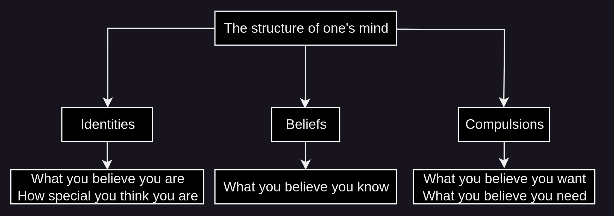

# Nihilism: Mantras to reset the Mind 

In case if you were wondering why i keep talking about Nihilism.

## **The structure of your mind**

When we're talking about resetting the mind, we're talking about the following variables:

    
    
    What you identify with
    What you believe in
    What your compulsions are
    	
    

There is a common belief that people have, that for some reason these are determined from the start and they cannot be changed.

Over time, the more identified you are with those 3 facets of your mind, the more you reinforce them, with enough cycles, at some point they may become so reinforced that you cannot just break free from the cycles you have indulged into, and you may feel trapped within your own mind. That is usually where depression comes from, your inability to rewrite your mind as you see fit, essentially a loss of control over your own mind.

Control over your own mind is something you need to practice every day, if you want to make sure it keeps doing what you want it to do.

Now one facet of your own mind is that you can't just start thinking in terms of **"Ok now do not think about monkeys!"**. Your mind is like a car with no brakes, wherever you press it, it goes further into that direction.

Now the thing is, your intellect is like a knife. It is there to dissect. And your identities that you have picked up are all hands, that grab onto that knife. **The more identities you pick up, the more uncontrollable your handling of the knife is, the least you are able to have a quiet mind.**

**Until you completely get rid of all of those things you are not, it's going to remain an ongoing mental diarrhea, you'll never be able to stop your mind.**

But it doesn't stop there, you are also beliveing things that you do not truly know, If you think you know everything, how the hell can you sit still and shut up ? It's never going to happen.

And you may have picked up compulsions aswell over time, things that you think you want, and things that you think you need. You won't be able to sit still either if you keep believing you need and want those things.

Without being able to reset your mind to wire it the way you want it to be wired, you won't ever know peace of mind.

## **Is it normal to follow the norm ?**

Suppose you are on the road, driving at full speed. Are you more at peace when you see that there is nothing obstructing the road, or when there are obstacles on the highway ?

Suppose you are trying to enjoy the sun outdoors, do you want there to be anything obstructing the sunrays from reaching you? 

This is all you are doing when taking up identities, beliefs, compulsions, and allowing them to permanently stick to you.

You have taken up masks after masks, placed it on your face, one on top of the other, and now they have begun to stick to your face. the more layers you stack on top of your face the less you are able to percieve things as they are. On top of that you are unable to take those layers off without being in pain. Over time you may have even given up trying to remove them, and probably you have even started to accept this mess as your new normal.
    
    
    After all, everyone's like that, why does it matter if i become like them aswell, i'll fit right in !
    
    

Thing is, even if you're in a madhouse where being mad is considered being normal as we have [previously explained](../poisonofmoderntimes/index.md), you better stay mentally sane and refuse to fit in, especially if you want the ones that are stuck there to come back to mental stability one day. 

**In this madhouse of a world where everyone has lost their way, whoever truly has clarity will initially be percieved as mad, but only the sane one realizes that everyone's been mad the whole time.**

This is where the crux of the problem is, the less you exert your ability to choose how to be, how your body is, how your mind is, how your emotions are, how your very life energy is, the least control you have over it. When you start making it normal to loose control over them, do not be surprised that they start to deteriorate and break down.

Which is normal ? Is it normal to throw your hands up and just proclaim that you are only human ? **Or is it normal to refuse to accept your current limitations as being normal ?** Are you going to accept being forever stuck in your current state of being ? 

Do you seriously believe that this body of yours, and this mind of yours, were designed to produce the suffering you are experiencing ? On the contrary, they were designed to produce incredible levels of wellbeing, the thing is that you've been given a very intricate technology and you don't know how to handle it, It's not painful because that's it's their nature, it's painful because you're not handling the super-super computer like a blacksmith.

To be able to evolve from where you currently are, into the one you are supposed to become, you must be willing to lay waste to everything that you believe you want, need, know, and are. **However, the necessary dissolution that needs to happen is not physical in nature. It is of a mental nature.**

As you'll see in the following tutorials, the reasoning behind the nihilism practice comes from a minimalism approach but applied on your mind directly. Where everything that is not justified to remain in your mind is supposed to be thrown out. **Everything that's on your mind must serve the one you are supposed to ultimately become, and everything else is to be destroyed.**

You can't leave filth in a holy temple, because otherwise you won't be able to appreciate the subtle sanctity that the holy temple is supposed to have.

**Your mind is that holy temple, and the filth is all of the identities, beliefs and compulsions that you have accumulated over the years.** Nihilism as a practice is meant to be the cleansing of that holy temple, to continuously keep the temple free of filth, free of distractions, free of anything that is not truly needed, **so that you may use it for what it was truly made for.**

## **Do I need Confidence or Clarity ?**

So we need affirmations to alter one's mind, but should they be positive or negative ?

Most of the affirmations you're going to find online are 99% positive, because they are about building confidence, rather than building clarity.

Positive affirmations are fundamentally flawed because they are meant to either puff up your ego, your beliefs or your compulsions. By puffing up either of those 3 you arrive at confidence, not clarity. 

Suppose you are driving on the highway at 130kmh. But suddenly you can't see anymore because there is alot of fog. (Meaning that there is no more clarity at the moment).

**Do you try to puff up your confidence to keep driving at 130kmh ? or do you wait for the fog to clear up (meaning for clarity to return) to drive at 130kmh again ?**

Of course, if you are not insane, don't want to wreck your car and potentially end up dead you'll wait for the fog to clear up to drive fast once again.

**Confidence is not a substitute for clarity.** In fact there is no substitute for clarity. You anyway have to adapt your speed of driving to the extent that you have clarity of the road ahead. Without clarity you have to drive slowly, it is only with enough visibility that you can drive faster safely.

_the Nihilism mantras are not positive, because they are not about building confidence._ Rather, they are purposefully negative because **these are tools to restore clarity** into you. Positive affirmations would otherwise bring solace, puff up your ego, empower delusionnal beliefs, and reinforce automatic behavior, at the expense of your Clarity. If you want to be able to drive fast, you don't need confidence, you need clarity. **These affirmations bring clarity, because they are geared to destroy the obstacles and distortions that are in between you and what you are supposed to percieve.** Identities, Beliefs and Compulsions, _these are are all obstacles that you must destroy on a daily basis_ to be able to maintain that clarity within you. 

Another way of looking at it is that you sooner or later you'll need to realize a series of things, such as your true purpose in this lifetime, sooner or later in your life you're meant to realize those things. But how soon or how late you're going to realize those things? _It all depends on how clear your perception is._ When the time comes, **Will your ego be in the way ? Will your false beliefs be in the way ? Or will your addictions be in the way ?** These lightning strikes will invariably happen in your lifetime, and you never know when they will happen. That's why you need to be ready and receptive at all times, because you do not know when it's going to strike, and those may only strike once and never again in your lifetime.

You may have been going in the wrong direction for your entire life, you may have been wasting all that precious time away so far, and one day, one random dude on a random blog on the Tor network may tell you something that could make you realize the most important thing you may have ever came accross in your lifetime. But your ego, your beliefs, and your compulsions may prevent you from listening, understanding, percieving, recieving that important message. It is only if you are receptive to the message that you could realize that your life was meant to go in a totally different direction.

## **Nihilism: in Nothing we trust**

In philosophy, nihilism; from Latin nihil 'nothing') is any viewpoint, or a family of views, that rejects generally accepted or fundamental aspects of human existence, namely knowledge, morality, or meaning.

While it is often mistaken for pessimism and depression due to being about "Nothing" (but in fact, **pessimism comes from negative identities, beliefs and compulsions**), Nihilism counterintuitively is actually essential to your mental health, **especially because it allows you to dissolve your concretized thinking patterns, reinforced identities and false beliefs.** It is a way of efficiently restoring your neuroplasticity, or in other words, your ability to rewire your brain the way you see fit.

Your inability to control your own mind (and therefore the source of all that pessimism and hopelessness) comes from having all those identities, beliefs, and compulsions. **Your inability to control your mind is the only reason you are miserable.**

It's about time you start to take back control over your own mind. What happens outside of you may not always be in your control, but **Everything that happens within you is 100% in your control if you choose it to be**. Let's take back control of it shall we ?

My approach to Nihilism is structured around the 3 main variables that can be influenced over your own mind, your identities, your beliefs and your compulsions.

Don't be fooled, most people percieve Nihilism as pessimism, But they fail to realize that pessimism is a also set of beliefs, identities and compulsions, that are destructive in nature. **No, these are also meant to be destroyed with the following practice. We aim to dissolve both the positive AND the negative identities, beliefs and compulsions, because that's the requirement to restore Clarity.**

Nihilism as a practice is composed of 3 Mantras, each are designed to dissolve a facet of your own current way of thinking and your current way of percieving things.

**_The Three Nihilism Mantras:_**
    
    
    Opus Nihil: to dissolve your compulsions (including addictions)
    Inhalation: I want nothing,
    Exhalation: I need nothing
    
    Scio Nihil: to dissolve your beliefs
    Inhalation: I know nothing,
    Exhalation: I know nothing else
    
    Sum Nihil: to dissolve your identities
    Inhalation: I am nothing,
    Exhalation: I am noone
    
    

None of those sentences may make sense at first, but in their own way these are all deeply rooted in reality (**i have rewritten them more than 50 times over the course of the last 10 years, with daily use**). There is a way to percieve each mantra, in a way that makes sense, _to give it additional weight as a fundamental reality that shouldn't be forgotten_ , upon mentally uttering them. 

  1. [Opus Nihil](../opus-nihil/index.md): What is it that you truly want ? What is it that you truly need ? What do you even need to survive ? 
  2. [Scio Nihil](../scio-nihil/index.md): How can you possibily know anything at all ? Do you realize the magnitude of how little you truly know ?
  3. [Sum Nihil](../sum-nihil/index.md): Do you truly matter in the grand scheme of things? Among 8 billion humans, Are you truly as special as you think ?

All you need to make use of them is to sit comfortably in one place, to close your eyes, and to intentionally and repeatedly, mentally utter each sentence in synchronisation with your breath.

**Each thought being mentally uttered, must last the entire duration of the Inhalation or Exhalation.** Given the level of focus it takes to maintain it over long stretches of time, if you are doing it correctly, you shouldn't be able to fall asleep while doing it, especially if you are intentionally slowing down your breath the whole time.

Give it a solid try (do it **once a day for at least 5 minutes at a time**) if your mind hasn't stopped producing internal suffering for a long time. 

One of the first signs that this is working, is if when you stop uttering the mantras, and just breathe normally without eyes still closed, **your mind should be able to remain at ease, without thinking unecessarily.**

Over time, once again you will be able to enjoy the sunrise in the morning, you may rediscover small things that you may have forgotten about, such as how beautiful nature can be, and how peaceful it can be. 

Keep in mind that this is not a one-time deal, this is to remain a daily practice, it can be practiced whenever you have a few minutes to sit by yourself, quietly with your eyes closed. At least 5 minutes a day, but ideally 20 minutes in total.

Make no mistake, it is very easy to fall back in the trap of being identified with things that you are not, believe things that you do not truly know, and fall into new compulsory behaviors. But at least when you are taking a break from the madness, you are able to see when you are stepping into it and when you are stepping out of it.

**The virtue in annihilating everything that is not truly you, is because in the end, Only the real you will remain** , and the real you, while being ineffable, and impossible to describe with words, is perfect in every way.

