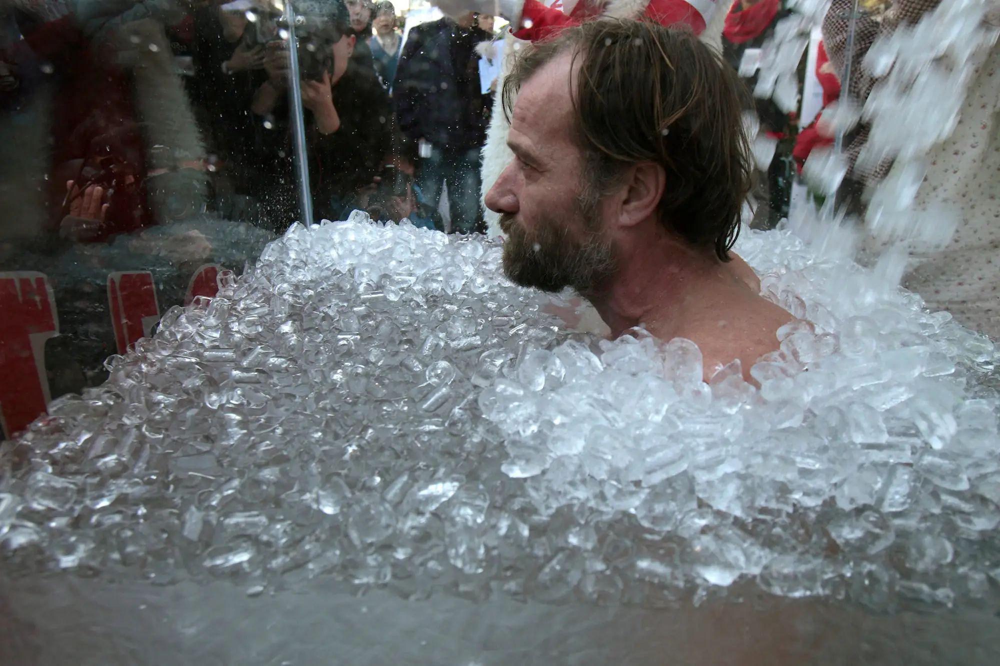

# Opus Nihil: Dissolving Compulsions 
    
    
    I want nothing, I need nothing
    
    

` 

In this tutorial we're going to take a look at the first Nihilism mantra that you need to know. It is the one that will help you regain, maintain and reinforce your ability to control yourself, as it is a crucial tool to have in order to be able to unwind addictions, in order to move from compulsive behavior, towards conscious action.
    
    
    Underground, I sat next to the crystal-clear lake, sublime, untouched, pure.
    It doesn't need anything, besides being contemplated for it's own beauty.
    [...] Should I dump black ink into it ?
    	
    

Your brain has a reward system (which is a collection of brain structures and neural pathways that are responsible for reward-related cognition), that essentially makes you feel good upon encountering certain stimuli. The problem is that your brain may give you the reward not for you actually achieving your work, but rather it may reward you along the way for totally unrelated things.

This ties into the "Carrot & Stick" discipline method, **you need to be very careful where is the positive outcome at (where the carrot is)** , and where the negative outcome is (where the stick is)

You need to **make sure that the carrot stays the same,** from start to finish, and to do so you better make sure that nothing stands in the way of your work.

Over time you may become completely desensitized after indulging into too much stimuli (video games, sex, substance abuse, etc), so much so that nothing may feel rewarding anymore. and definitely not accomplishing any meaningful work. 

You need to resensitize yourself, by cutting short all of that excessive stimuli, **so that the carrot may take the correct shape once again.**

Addictions are essentially compulsory behaviors that you are having a hard time stopping yourself from doing. **You can consider this as going in circles.** You used to walk in a straight line, going to a great destination, **but somewhere along the way you wanted to escape the discomfort, and you started to walk in circles.** The end result, you guessed it, as long as you keep walking in circles, you're never going to go anywhere.

Whatever truly matters to you is a distant destination, **and you will never get there by going in circles**. That is why it is important to make sure that your compulsions are dissolved, and making sure that they stay dissolved. 

## **What is it that you truly need ?**

Do you even know what you truly need ?

Look back the last 10 years of your life, did you always need the same things just to live ?

Did you take up habits over that period of time, things that you did not even need in the first place ?

Let's take the most common: Alcohol, Coffee, Tobacco, Weed, and similar substances. **Do you actually need those ?**
    
    
    Upon the crystal-clear lake, What would happen if I threw poison into it ? I want to see.
    I like what happens when i throw it in there, i think i want to do it again,
    [...] I've been doing this for a while, I think i need to keep doing it
    
    

At first it may just be wanting it, **but over time it may turn into the illusion of needing it.**

After indulging into those things for a while, do you even want them ? is it true that you need those things ?

**Lock yourself up for one full week, with only 2 meals per day, and water. Are you still alive after that week ?**

You don't need anything else. Work that poison out of your system.

## **What is it that you truly want ?**

Do you even know what you truly want ?

Look back the last 10 years of your life again, did you always want the same things ? Or did the things you wanted for yourself change over time ?

Most likely, if you have a very active life, the things you wanted at one point in life, you no longer wanted them the next month.

Perhaps even, now you realize that you didn't truly want those things in the first place.
    
    
    We all try to get more of something, whatever staircase you have found, be it Money, Power, Fame, or Substances
    We all want to get more of something until we arrive at infinity, but that will never happen by doing additions.
    The only way to arrive at an absolute, is by subtracting. You can arrive at emptiness, not at fullness.
    
    

Truth is, the content of our minds change on a regular basis, you can't ever be sure you truly want something, in the long run.

Moreover, is it something that YOU want, **or is it something that someone else wants you to pursue ?**

Maybe you don't truly want something in the end, how can you be sure you're not chasing someone else's dream ?

**Lock yourself up for one full week, with nothing to do, observe yourself and how your mind starts to act up.**

The poison is not only physical, it also comes in the shape of thoughts that are not truly yours. You need to work that out of your system too.

## **The Poisonous Ocean of Pleasure**

There exists an ocean out there, containing all of the pleasures you can imagine and the ones you can't even imagine. It contains more pleasure than you'll ever be able to experience. Even if you were to only dip your toes in it from time to time, you'd have enough pleasure to experience to last an entire lifetime.

At first when you were young, you were on the shore, you didn't know of the pleasures of this world, back then the world was beautiful, intriguing, radient, every little thing was an adventure.

And then you started to go into that ocean, you experienced pleasure you didn't even believe was possible to experience. Since then, everything else that doesnt provide that pleasure felt boring, unsatisfying, pointless. 

After a while, you kept going back to that ocean again and again, but for some reason it was never enough, you never stopped going there, so much so that you started to swim into that ocean, as far as you could go, to feel as much pleasure as you possibly could.

Problem is, the farther you go into that ocean, the bigger the waves are, it becomes increasingly more difficult to stay afloat and breathe.

You lost control in that high sea, and the waves keep crashing onto you, sending you underwater, making you sink lower, and lower.

If you are or have been one of those people whose lives have been destroyed by addictions, i'm sure you know exactly what i'm talking about. You know what that rock bottom feels like. At the bottom of that ocean, there is only darkness, there is no joy at all. Only pain, and suffering.

The moral of the story is just this: There is more pleasure than you could ever experience in your entire lifetime in that ocean, **the deeper you go into that pleasure ocean, the darker your world becomes. Therefore if you want your world to remain beautiful, you must stay out of that ocean altogether**. You must not only reject the act of indulging in pleasure, **Most importantly you need to realize that you do not truly want it, nor need it.** You need to reject the very idea of indulging into Pleasure altogether.

**It is by rejecting that ocean of pleasure, (not just temperance, complete abstinance) that the beauty of your world will return.**

## **Nihilism: Dissolving Compulsions**

Modern Nihilism, as i am pionnering myself, is a set of sentences, or mantras, to be repeatedly mentally thought of, in order to change yourself from within, this aims to alter your perception, your beliefs, and your actual sense of self.
    
    
    Opus Nihil:
    Inhalation: "I want nothing"
    Exhalation: "I need nothing"
    
    (Sidenote: each mantra utterance must last the entire (intentionally slowed down) Inhalation/Exhalation, to silence the other thoughts)
    
    

We normally breathe 50% deep, to do the nihilism mantras effectively, you are supposed to breathe 2 times slower, and 2 times deeper (full inhalations/exhalation), AND the mantras you mentally utter need to last the entire duration of the inhalation, and exhalation

_Warning:_ do not mistake this for being pessimism, the goal is not to make you not want or need anything, but rather to make sure you get rid of everything that your life was not meant to truly be about. **In fact, is it not rather because you stop indulging in all addictions that you are finally going to do what you were truly meant to do ?**

It doesn't matter what you currently think you want, or what you think you need. It's an illusion anyway. And to be able to get rid of those compulsions, you need to uproot them from your mind directly.

It is all up to you. **Are you going to need a cane to walk forever? Are you going to seek puerile pleasure all your life?** Stop being what others want you to be, dissolve it all. Hit that reset button.

Repeat that mantra for a while, **keep doing it as long as you need to, until all the poison has been worked out of your system.**

The lake has not been clear for a very long time, but it needs to become clear again, and to be kept clear. We are talking about **resensitization** :

Once the slate has been wiped clean, once clarity is back, think for a while. **What is it that you truly want to do with your life ? What will bring you the most satisfaction, until the very end ?**

In that moment of clarity, decide for the next 10 years, what will your life be about. Then stick to it, no matter what happens. **If your mind deviates from that goal, dissolve the falsehoods again, and again** , keep the lake crystal clear, every day, only then will you function at your peak.

If you ask me, when looking at the problems in the world, the biggest problem of all the addiction to money, due to that one in particular it has become such a sick world, everyone should put in effort to starve off addictions wherever they can, otherwise we will keep on burning the world away until someone's insatiable greed destroys the world altogether. 

## **Opus Nihil in action: Escaping the Addiction Cycle**

Let's say you have 12 days ahead of you right now, and you pack your schedule to make the most out of it:

Great, you won't have any reason to be bored and indulge in any addiction whatsoever. In theory it sounds nice, but if you have been addicted for years on a substance or on some addictive behavior like me (i've been addicted to playing way too much video games), **But in practice your brain is going to want to escape the increasing discomfort of the grind you scheduled, to do something more relieving sooner or later during the day.**

You start the day grinding. On the first task, you're fresh out of the [cold shower](../coldshowers/index.md), energetic and ready to roll. Once you completed the first task, you move on to task B, still in the flow you keep going. Moving on to task C you're getting tired, but you keep pushing forward. And now here comes Task D where you're getting mentally exhausted. **The bigger the discomfort, the more likely you're going to want to escape the discomfort by indulging in some addictive behavior just to feel better.**

Be extra careful when the discomfort is at it's peak, **as it is the sign that you need to rest and recover, so DO NOT indulge in an addiction**. Indulging in an addiction can be as simple getting the idea, opening the web browser, typing the URL to a website, and opening it. Be aware of what the addiction cycle is, and especially that it starts as a simple thought in your mind:
    
    
    "Man i really need [...]"
    "Just one more time won't hurt"
    "Just one last time, i deserve it"
    "I need it, i deserve it"
    "Noone will know that i did it, it's okay"
    
    

` 

1) **The best moment to do the Opus Nihil meditation is right after the idea of indulging in pleasure appears in your mind.** Because you are actively rewiring your brain to a different thought pattern, and with enough repetition, your brain won't associate the idea of indulging in said addiction as a solution when facing discomfort. As explained above, the goal is to move from compulsive action to conscious action.

2) the next-best moment to do the Opus Nihil meditation is when the ritual begins but indulgence didn't start yet. At first your mind is not trained enough to stop itself as soon as the poisonous thought emerges, and you may end up starting the ritual on autopilot (ex: starting to type the URL of the website in the browser), **This is also a good place to start the opus nihil meditation, to dis-engage in the activity and stop it brefore it's too late.**

If you don't manage to stop yourself on time and begin indulging in the actual addictive behavior, try as you might, opus nihil won't be able to stop it until you finish spiking your dopamine (aka feeling alot of pleasure in one go). This is when it's too late to do the opus nihil meditation.

3) Lastly if your addictive behavior produces negative side-effects (it can be shame, pain, depression, unrest, disease, or even cardiac arrest) Opus nihil is also a good thing to do as you're going through the negativity, **because you want to associate the addictive behavior / substance with the hell that you're going through at that moment** , view it as a "fuck that, never again!" mode of thinking. It is a last resort at helping escape an addiction cycle, but if you're in one of the hardest addictions to quit like opiates, every little help you can get to get out of the downward spiral is a good thing.

Lastly, not everyone has the mental thoughness to escape their own addictions on their own. Do not hesitate to some outside seek help if you can't escape addictions on your own (especially with hard drugs, in practice it's very hard to quit them). **However, to successfully unwind addictions, YOU must want it.** You must decide that you want to get out of the addiction cycle, and then you must implement opus nihil wherever possible to unwind the spiral as much as possible, until the self-destructing pattern is completely gone from your mind.

Sobriety is not boring, it's not something to discard, on the contrary it must be cherished, because to remain Sober is to ensure that your world gets to remain beautiful. **Stay out of the darkness of addictions, always function with all of your mental faculties, thrive, and go change this world for the better.**

