# The Poison of Modern Times 

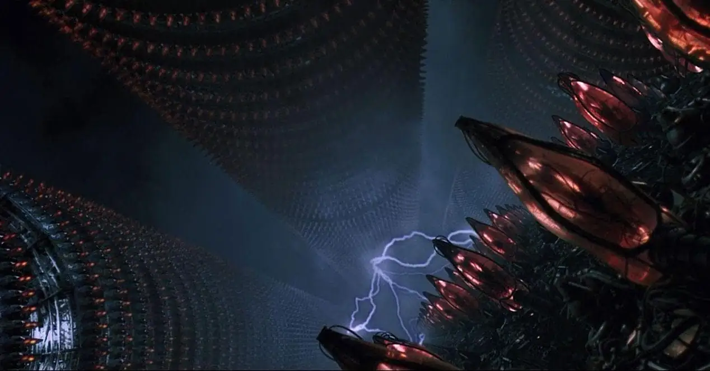

At some point in your life, you have invariably felt it. There is poison that is being spilled all around the world, straight into your mind. It has been changing everyone around you, it may have started to change you aswell.

But why is nobody talking about it ? Why is nobody naming it, calling it out ? Why is nobody questioning it's existance, or it's authority ?

The mind poisoning of mankind is real, it has become efficient, it has become convenient, and even worshipped.

## **How is the poison manufactured ?**

99% of the societies out there are structured by having a government at the very top, which regulates everything and everyone on it's own geographical territory, from the largest corporations, to the smallest businesses and employees at the bottom.

The only problem is that there has been a false belief that has been perpetuated by those governments, **the false belief that one's life fulfilment comes from outside.** From that one false belief, everyone in society has been led down the path of countless addictions, compulsions, false beliefs and unwanted identities.

### **Governments: The source of the poison**

At the very top you have governments, or states, which are all illegitimate groups of people that have seized power through faking choice for the masses, by giving them the illusion that they are acting on their behalf.

**The reality is that governments only care about staying in power.** But to do so, they need to propagate their poison straight into the minds of the countless masses that they intend to rule over.

The first step is for the government to have a monopoly on violence, to submit every dissident into submission and obedience, that's what law enforcement is there for, with jails to exhibit to the masses what disobeying looks like, to prevent other people from disobeying aswell.

Then, to reinforce the acceptance of their existance, they implement the voting system, where the masses are given the illusion of choice (which all lead to the same result of them being ruled by tyrants), **to try to push the false belief that the masses chose this government**

Those multiple political parties employ identification as their catalyst, they try to make the masses identify with their messages, because **it is by making people identify with something that those people start to believe in their lies.**

And the last key to power is to have a state-issued currency, this is to make sure that the government stays all-powerful money-wise, at the expense of everyone underneath them. It is to make sure that there is a carrot that everyone chases their whole lives, while at the same time remind them that if they don't chase it, they will end up on the streets. **This is the carrot (becoming rich) and the stick (staying poor) that they will do everything they can to remind everyone of.**

This is why governments and especially banks make people take loans for education, or for buying houses, that is so that those people spend most of their lives repaying those loans, making sure that they remain obedient and dependant to the system.

### **Corporations: The manufacturers of Poison**

Right underneath the government, you have Corporations that do everything to harvest as much money as possible, at the expense of the whole world.

**Destroying the entire world in search of profit** is the final destination of society as we know it, and corporations are the engine that are taking us there. 

On that quest, Corporations serve many purposes, which is mostly accelerated by the [centralisation of the internet](../../opsec/clearnetvsdarknet/index.md), where they propagate propaganda everywhere they can, while at the same time facilitating the passing of that same propaganda, by artificially and intentionally increasing and decreasing each and everyone's visibility and discoverability at the request of governments.

The power that those corporations (especially on social media and news broadcasts) wield over everyone's minds is immense and it is not to be taken lightly. **Their propaganda goes through Television, Radio, News outlets, Social media, podcasts, and even advertisers.** Every medium is a good medium for propagandists as long as it can be used for their message to reach the masses quicker.

Even so-called independant journalists are no exception from this wide-spread corruption.

It all revolves around getting that one extra state-issued currency, the Carrot of profit, and the stick of staying poor, irrelevant, and silenced. **This is why there is so much corruption in the world**

This is something you'll see in action especially with dissidents on social medias, they are silenced, made invisible, shadow-banned, deplatformed, and so on.

Everything is done to protect the false beliefs that the government wants you to hear, see, and believe.

Not to mention that in order to keep grabbing your attention, nothing is out of bounds. This is known as [the war on attention,](https://lichess.org/@/BenjiPortheault/blog/the-war-on-attention/zhrVS53D)

**Addiction to short-time content is the main vector** , where it is made easy for you to fall into repetitive actions, where you can easily spend entire days at a time continuously searching for that one more content on the same platform.
    
    
    The fastest growing sector of the culture economy is distraction. Or call it scrolling or swiping or wasting time or whatever you want. But it’s not art or entertainment, just ceaseless activity.
    The key is that each stimulus only lasts a few seconds, and must be repeated.
    It’s a huge business, and will soon be larger than arts and entertainment combined. Everything is getting turned into TikTok—an aptly named platform for a business based on stimuli that must be repeated after only a few ticks of the clock.
    Ted Gioia
    
    

The clearest place you can see this in action is on the youtube crypto section:

Everything is made so that you are baited into clicking their worthless content (yes, [bitcoin is worthless](https://www.youtube.com/watch?v=YTTac2XjyFY)). All of it so that you may view ads forced onto you by youtube, so that they may generate profit for themselves, and by extension the """content creator""" (**more like the addict creator**) is reaping some of that profit themselves for successfully having made you click. All of it is done in search of pleasure, **On those platforms, Everyone is desperate to remain relevant, to be able to get that one more dollar carrot**. Despite the incredible amount of content, 99% of the content uploaded there is produced out of desperation. Everything about it is made to turn you into an addict. 

The human mind was not made to recieve that much stimulus, you were not made to take the weight of [everything happening everywhere all at once](https://en.wikipedia.org/wiki/Everything_Everywhere_All_at_Once), it's too much to handle in any case. (yes, go watch this masterclass of a movie, you'll understand exactly what mental overload means, and what it can lead to)

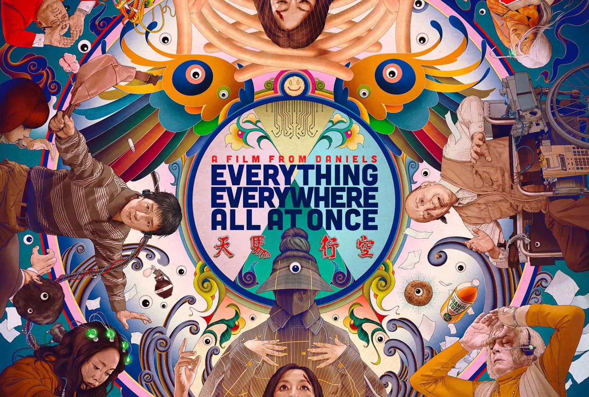

## The Dead internet Reality ([Video on it](https://www.youtube.com/watch?v=UnJKOYOkRMk))

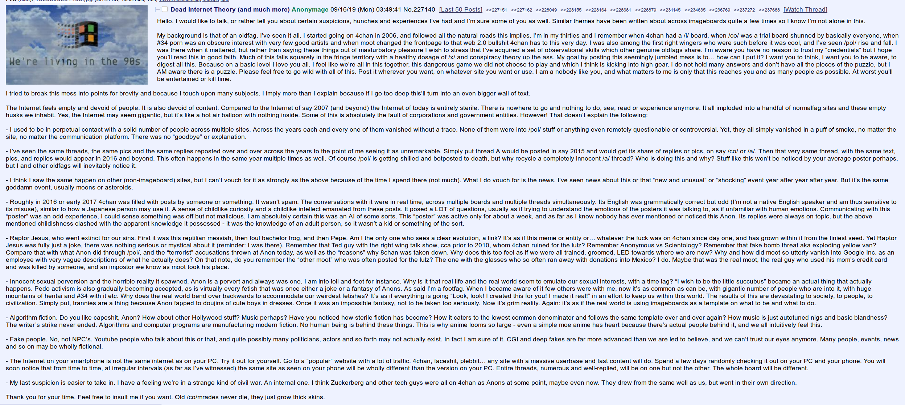

The clearnet internet as we know it is becoming increasingly more quiet.

People are no longer writing texts, they use LLMs to write it for them:

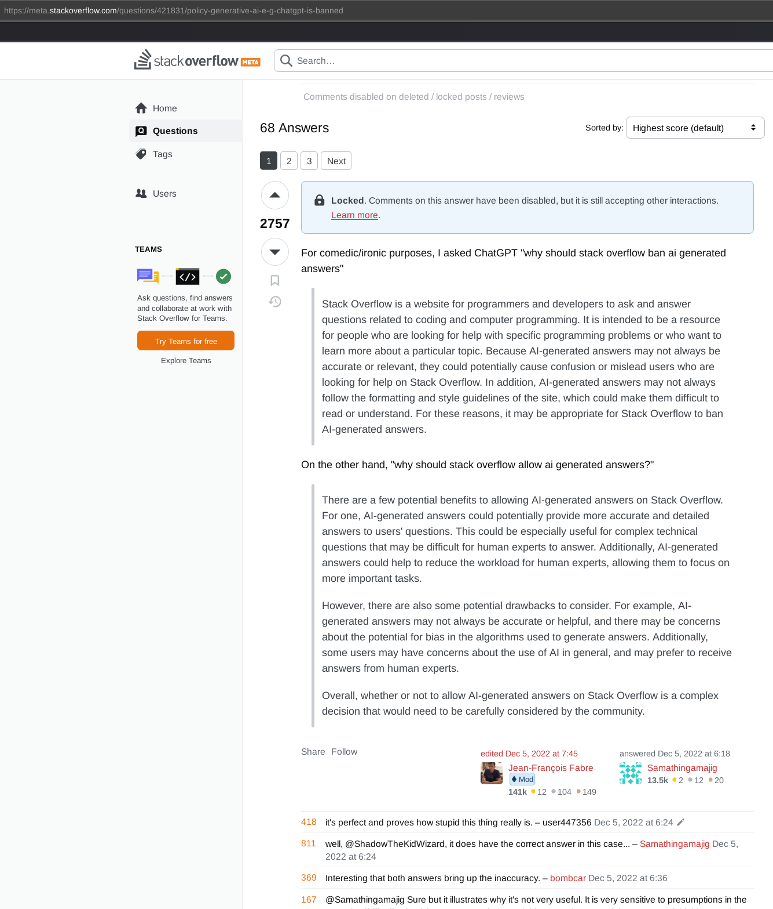

People no longer do art, they generate slop images using AI: 

People no longer make videos, they ask AI to make videos for them:

People no longer make music, [they ask AI to make music](https://www.youtube.com/watch?v=kIbWNXcYG0k) for them:

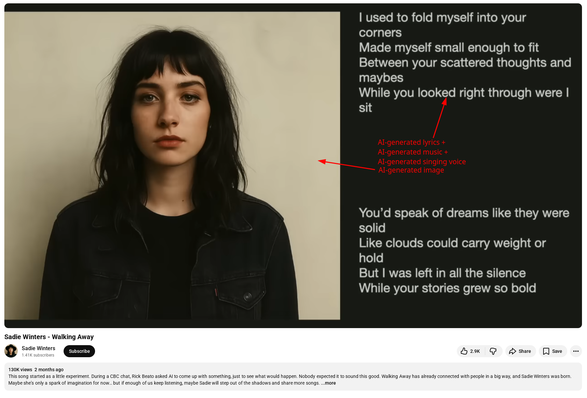

They also use bots to automatically create the channels, automatically generate their videos and their contents, automatically post them online, and automatically comment on those videos with more ai-generated content to boost their own visibility up the algorithm, competing against both legit content creators and AI-generated bots alike.

And people no longer argue online to further debates, they fake interactions by using AI to spread propaganda: 

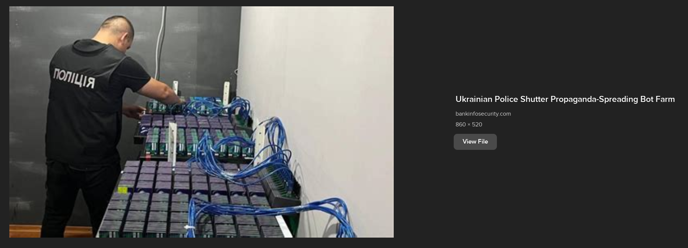

Not to mention [bot-farms](https://www.youtube.com/shorts/uX2awBEpMGU) being operated and rented for whoever has money to pay for their services.

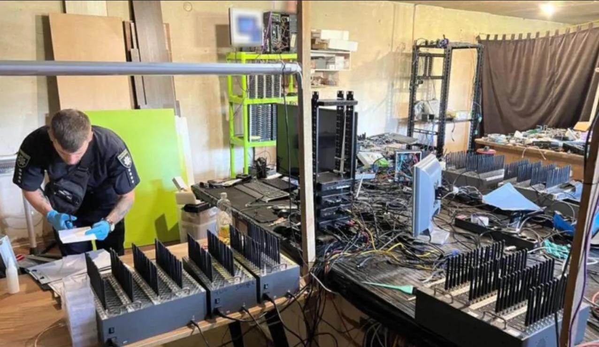

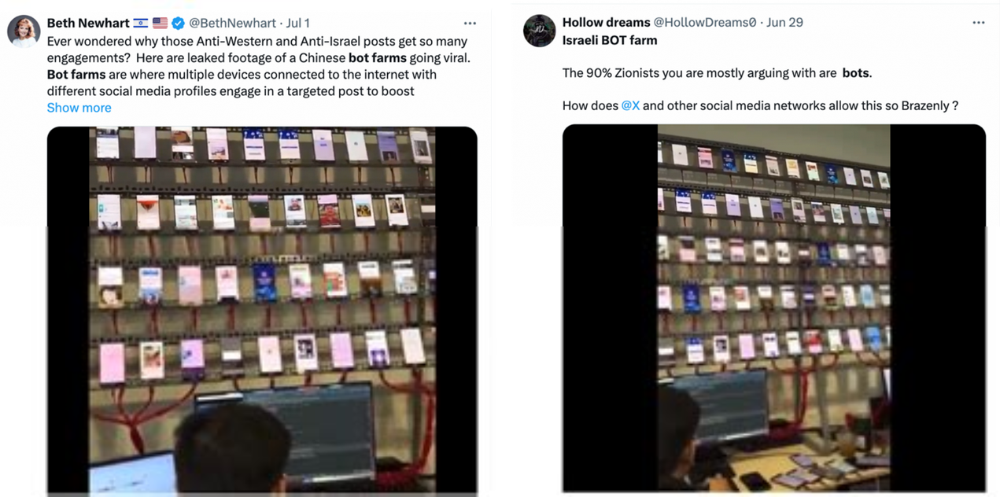

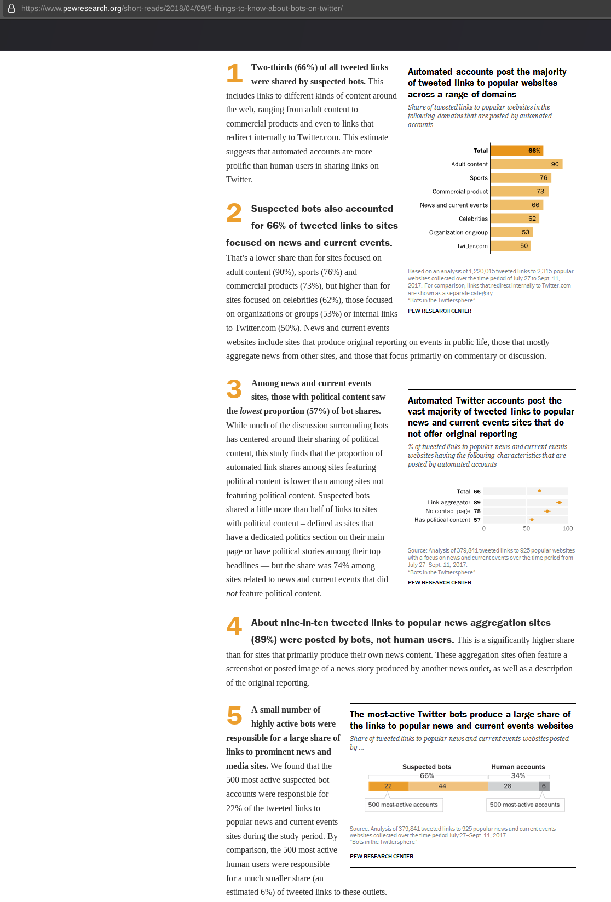

Some people have the nerve to talk about the dead internet being a theory instead of a reality, despite the overwhelming evidence against it.

AND add to all of that, that LLMs are training on data that they find on the internet, they keep on feeding on their own self-generated, innacurate bullshit, all for what ?

For the profit of whoever posts the right combination of AI-generated words, images, videos, music slop that makes the most people click, just to generate the most ad-revenue possible.

**Essentially rotting and killing the entire internet just to make a few extra bucks out of desperation.**

## The reason behind why people do things

Pay attention to what people are doing, **but pay even more attention at why they are doing it** , What are [the reasons behind people's actions](../rightthing/index.md) ?

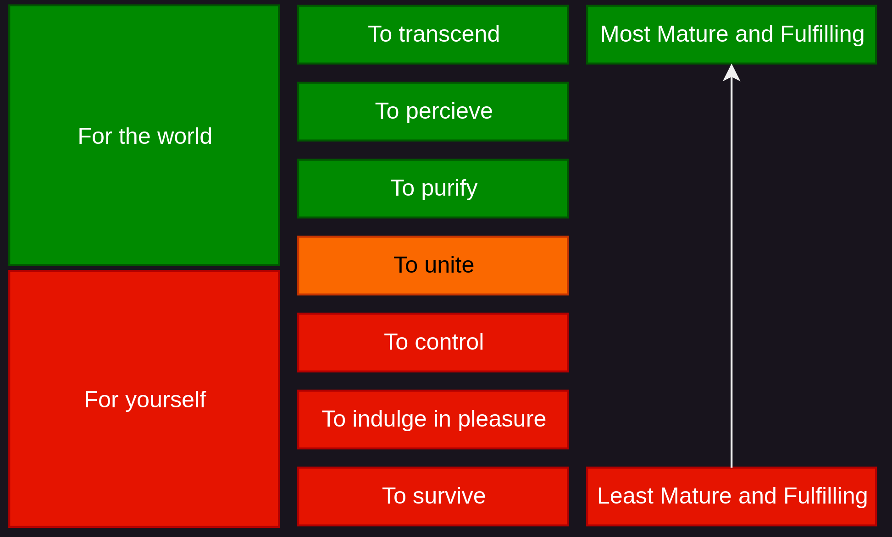

For everyone's tiny, and insignificant selves, capitalism is all about survival, indulging in pleasure and consolidating their current control, It is an egostistical way of living. **It is about making you believe that your life can only be fulfilled from outside**. When that is the way, Addiction to just about anything that makes you feel a little better is the result, no matter if it causes the world to be destroyed on the way.

If you are part of the unfortunate 90% of people out there, ask yourself if feeling pleasure is actually all that truly matters. If this is the case let's look at a few things that make you feel the most pleasure:

Do you seriously think that methamphetamine addicts are the most joyful and fulfilled people on earth ? On the contrary, it is exactly what is destroying their lives. **Pleasure seeking is the poison that is leading you astray** , it is from that central poison that you seek every other poison. Instead of looking for fulfilment from within yourself, you have been led to believe that it is supposed to come from somewhere outside. **It is because you think joy comes from somewhere outside that you are so desperate to find it** , it will always remain a random occurence that won't last long if you keep looking out there.

Before you indulged and abused all of those dopamine releasing poisons, you might have felt pleasure, perhaps even joy from looking at the sunset, from looking at nature, and all the mundane things in life. But after you start to indulge in bigger and bigger dopamine releases (meaning feeling increasingly more pleasure), **you end up desensitivizing yourself**

When you have such a huge caliber to shoot yourself in the head with, to feel that pleasure you seek, nothing else can compare anymore, you won't feel any pleasure from anything else. The brain will anyway adapt to it and gradually, you will feel less and less pleasure coming from the same activity. **You are essentially reducing your ability to appreciate the world more and more, the more you seek pleasure.**

You need to realize that **pleasure seeking is a path of self-destruction.** All the joy, grief, pleasure, pain, sorrow, ecstasy, and everything else you have felt so far, you have experienced from within yourself, you ARE able to generate those yourself and control them, without stimulation from the outside. _You are supposed to produce that wellbeing from within yourself,_ **True and lasting joy and wellbeing will never come from the outside, it has to come from within you.**

Hell, why do you think everyone has cannabinoid receptors in their brains right now ? Do you seriously think our ancestors were getting stoned ? On the contrary, it is the brain that is supposed to produce those chemicals from within, rather than ingesting it from the outside..

## **Systemic, self-reinforcing Mind Poisoning**

Let's suppose you fell for the poison of the recent US elections. You read a little too much propaganda and you identified yourself with either the rightwing party or the leftwing party, (It doesn't matter which side you identified with) you have taken up an identity, **from that point on the intellect will automatically do everything to protect it.**

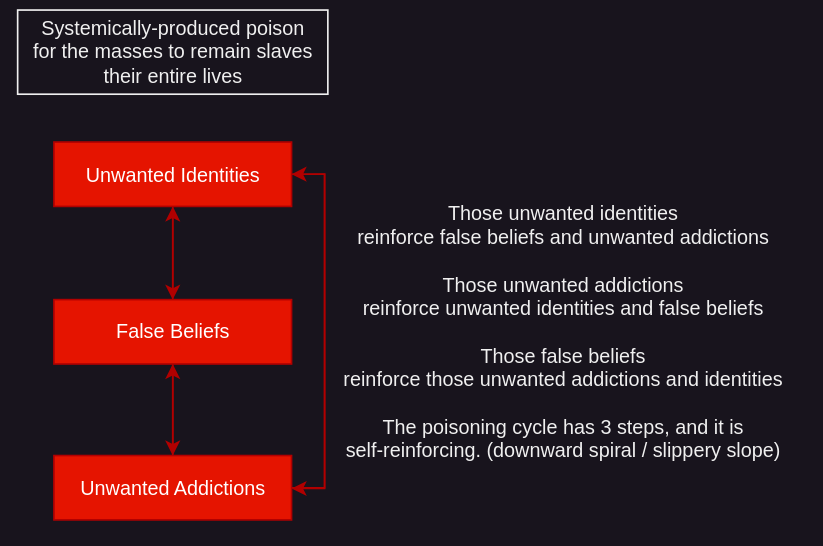

Now that you are identifying yourself with a political party, you are going to accept and believe their propaganda much more easily. And whenever someone starts to disagree on those beliefs you have picked up you're going to invariably clash with that other person, as either party is unwilling to listen to the other. **Nowadays people want to hear their own opinion come out of other people's mouths**

And lastly, with identities and beliefs combined, you are much more prone to indulging in addictive behavior associated with those 2. For example scrolling twitter all day (doomscrolling) to read more and more propaganda and to trashtalk anyone that doesnt agree with you.

**From the identities, to the beliefs, to the addictions. It is all the same poison.** It is what is keeping you distracted, addicted, unfulfilled, miserable, unhappy, obedient, and ultimately maintaining you enslaved to a system that you didn't ask for, yet are forced to participate into. 

And yet, for some reason everyone believes that this is normal isn't it ? Why are they putting up with it ? You need to understand that **this has been going on for decades,** due to how systemically this poison has been spread into everyone's minds, the generations that were born into it are more likely to accept it as normal.

One needs to realize that it has been going on, then one needs to understand and recognize that this IS poison, to actually want to reject it, to then actually reject it.

## **Only the mind can purge the poison**

So the poison managed to get into your mind, The solution is not going to come from outside, so don't try to listen to subliminals, binaural beats, hypnosis, affirmations or whatever other nonsense you can find on youtube.

The poison has arrived into your mind, **therefore it is your mind that must expel that poison**. The only way to get rid of that poison through natural means, is by using your thoughts in this specific way that i described in [ this tutorial](../nihilism/index.md).

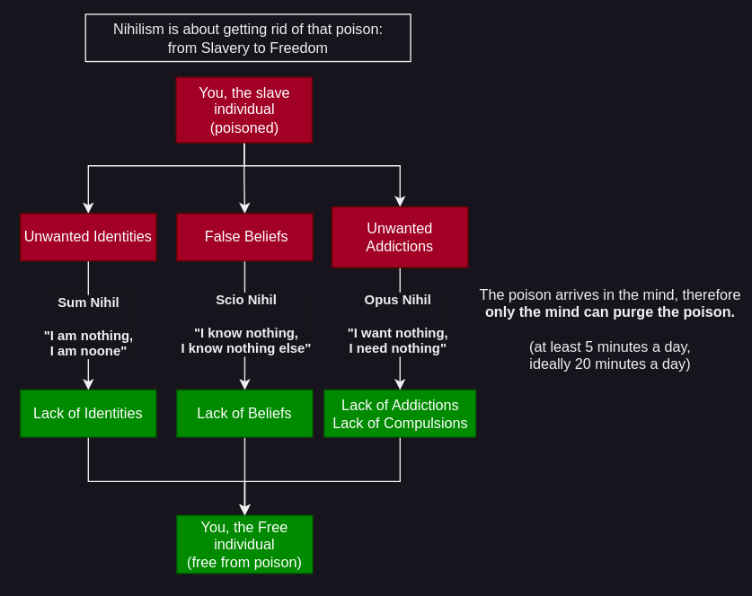

In short, to expel the poisonous identities, beliefs and addictions (since your mind isn't supposed to be society's garbage bin), you must spend at least 5 minutes every day, (ideally 20 minutes a day) repeating those mantras in your head.

[Opus Nihil](../opus-nihil/index.md) is about dissolving addictions and compulsions, allowing you to remain still and feeling whole.
    
    
    I want nothing, I need nothing
    
    

[Scio Nihil](../scio-nihil/index.md) is about making you realize that it doesnt matter how much you know, there is always more to know, that way you won't ever be bored or arrogant again, everyday will feel like yet a new adventure.
    
    
    I know nothing, I know nothing else
    
    

[Sum Nihil](../sum-nihil/index.md) is about putting you back in your place since you are a very tiny happening in the universe, Effectively bringing back humility into you and making sure that you are no longer in the way of your own actions.
    
    
    I am nothing, I am noone
    
    

` 

As [explained in the Nihilism tutorial](../nihilism/index.md), contrary to most mantras/affirmations you're going to find online, the Nihilism mantras are not about building confidence (positive affirmations), but rather, **these are tools to restore clarity (negative affirmations)** into you. Positive affirmations would otherwise bring solace, puff up your ego, empower delusionnal beliefs, and reinforce automatic behavior, at the expense of your Clarity. On the other hand, **these affirmations bring clarity, because they are geared to destroy the obstacles and distortions that are in between you and what you are supposed to percieve.** Identities, Beliefs and Addictions, _these are are all obstacles that you must destroy on a daily basis_ to be able to maintain that clarity within you. 

Once you have managed to take your mind out of that poison being spilled everywhere in the world, you'll be able to realize everyone else that's still hooked up on it. But the thing is, the individual has to be willing to expel the poison, it must come from their own individual will, you cannot force them from the outside, it has to come from within them aswell.
    
    
    “The Matrix is a system, Neo. That system is our enemy. But when you're inside, you look around, what do you see? Businessmen, teachers, lawyers, carpenters. The very minds of the people we are trying to save. But until we do, these people are still a part of that system and that makes them our enemy. You have to understand, most of these people are not ready to be unplugged. And many of them are so inured, so hopelessly dependent on the system, that they will fight to protect it.
    
    Morpheus, The Matrix” 
    
    

