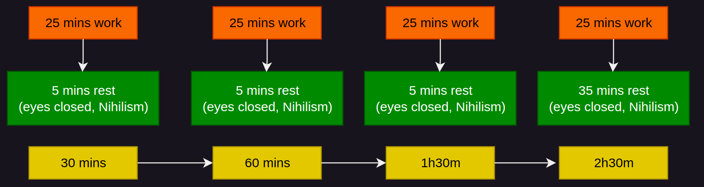
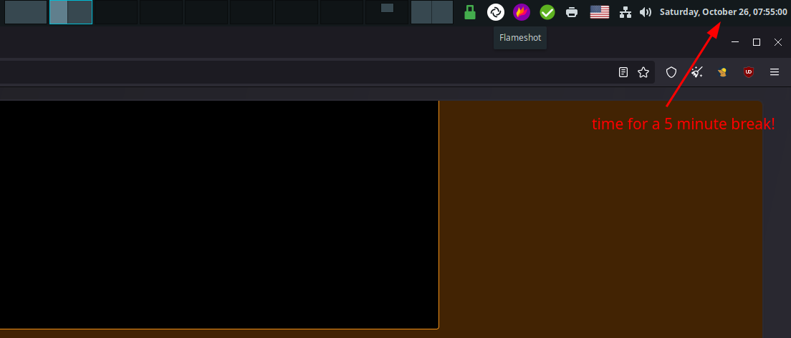

# Pomodoro Focus times (Intentional pauses to prevent burnouts) 

## **Why should I take pauses ?**

Following [my routine](../morningroutine/index.md) to the letter, it's now Saturday at 7 AM, you've made sure [that nothing can distract you from working](../mentalopti/index.md), all that's left is to work non-stop until the end of the day right? Well, you will see that there is a problem after some time.

So you're now working on the project of your life, and you've been working on one task without stopping for 45 minutes straight. Are you in shape to go for another hour without pause ? 

One analogy to compare this to is when you are running outdoors, doing cardio. can you really sprint all the time ? You can't do that. You can only sprint so long before **you need to catch your breath and make a pause, to be able to sprint again.** The same principle applies here, **you can't just focus all the time, you need to take small breaks at regular intervals.**

If your work matters alot to you, especially the projects that you decide to do on your free time, **You do NOT want to get burned out from doing it**. If your work matters to you, **you need to force yourself to take breaks** if you want to keep putting the best you can do out there. 

Now here the question is how long should the breaks be ? At what interval ? And do you even do during those breaks ? 

## **The Pomodoro Technique**

Pomodoro is a time management method orginially developed by Francesco Cirillo in the late 1980s, it basicaly uses a timer to break work into intervals that are 25 minutes in length, separated by short breaks of 5 minutes. 

The idea being that you are able to function at your maximum cerebral capacity on average for 25 minutes before requiring a break. And the break needs to last 5 minutes on average, before you are able to focus at your maximum capacity again. And after 4 working sessions, you take a long break of 30 minutes, or in my version of pomodoro, a 35 minutes long break:

The question also is what the hell do you do during your breaks? do you just open up your phone and start scrolling through social media? My recommended break method is to do a quick [Nihilism](../nihilism/index.md) meditation, to reset your mind:
    
    
    Recommended break:
    0) sit with your back straight
    1) close your eyes
    2) slow down and deepen your breath
    3) mentally, go over the 3 nihilism mantras for 5 minutes at least:
    
    Opus Nihil: to dissolve your compulsions
    Inhalation: I want nothing,
    Exhalation: I need nothing
    
    Scio Nihil: to dissolve your beliefs
    Inhalation: I know nothing,
    Exhalation: I know nothing else
    
    Sum Nihil: to dissolve your identities
    Inhalation: I am nothing,
    Exhalation: I am noone
    
    
    

In my opinion, this is the most efficient break you can take. As you are intentionally winding down your brain activity, on top of mentally dissolving what you were previously working on, and shifting your focus on something else (here, the slowing and deepening of breath and thoughts). If you do it right (meaning, if you managed to dig deep enough), **the moment you open your eyes again, you should rediscover what you were working on, as if it was the first time, with a completely fresh view on it.**

## **There is no Escape**

Now, you need to be extra-careful whenever you are finishing a work cycle, because this is when the discomfort is at it's peak, and that's where you are most likely to indulge in addiction:

This is going to require attention, and training but it will get easier over time, **you need to get over this habit of "wanting to escape the discomfort"**. Wanting to escape is weakness, it is giving up, it is failure, it is abandoning your duty. The "escape" can be many things, such as substance abuse (nicotine is most common), or simply social media, or viewing adult content, this is where you are suceptible to fall back into pleasure seeking, and right before you start to indulge in addictions, that is where **you need to make sure you do not enter the addiction cycle.**

You need to remind yourself, that there is no escape, there is no plan B, **the only way out of this, is through**. One way or another, you're going to finish the work, but to do that, you need to take a break, or in other words you first **need to reset the mind.****

Whenever you are finishing a work cycle, if you're still returning to **"i want to escape"** , you need to consciously shift your thinking to **"there is no escape"** , to **"i need to reset"**

With enough training, once you have accepted that there is no way out, your thinking pattern should go working **Working** , to **"I need to reset"** , performing your mental reset, **and then going back to Work.** That way you are cutting out all possibility of addiction, especially when you are comfronting yourself with discomfort.

## **How do i know i need to take a break ?**

Either you are self-aware enough to know when you are feeling overworked, and you'd do the reset instinctiviely, or if you're not self-aware enough i recommend to just look at the nearest clock:

Whenever it strikes **"minute 55"** or **"minute 25"** it is time to take a 5 minute break. 

**The first 3 breaks** will last **5 minutes** , and if it is your **fourth break** , it will last **35 minutes**.
    
    
    FIRST WORKING SESSION:
    -7h00 : 25 minute work
    -7h25 : 5 minute break
    
    -7h30 : 25 minute work
    -7h55 : 5 minute break
    
    -8h00 : 25 minute work
    -8h25 : 5 minute break
    
    -8h30 : 25 minute work
    -8h55 : 35 minute long break
    	
    

During the each break recommend doing the nihilism meditation, in order to dig deep into yourself, and to recover on a deeper level. Another way of doing it is to go out for a walk, as the reasoning is the same, you are intentionally changing the context, changing what you are doing, and lowering the mental effort as much as possible, so that your brain may integrate what you were doing, and recover from it.

And then you can repeat the working cycle once again after the 35 minute break is over:
    
    
    SECOND WORKING SESSION:
    -9h30 : 25 minute work
    -9h55 : 5 minute break
    
    -10h00 : 25 minute work
    -10h25 : 5 minute break
    
    -10h30 : 25 minute work
    -10h55 : 5 minute break
    
    -11h00 : 25 minute work
    -11h25 : 35 minute long break
    	
    

And thats it! You now know how to not get burned out at the end of the day, while putting out as much work as you possibly can.

