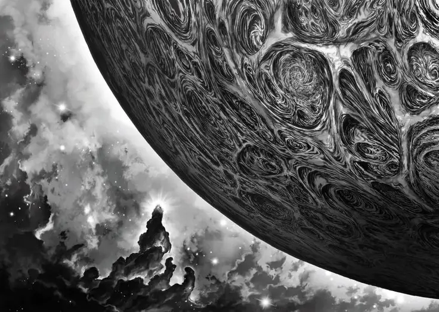

# Scio Nihil: Dissolving Beliefs 
    
    
    I know nothing, I know nothing else
    
    

` 

In this tutorial we're going to take a look at the second Nihilism mantra that you need to know, as it is the one that will ensure you remain open to the possibility of knowing. It is used to trim away beliefs, to be able to undo all distortions that one may have upon his own perception.
    
    
    One day, Aristotle was walking on the beach. A glorious sunset was happening, but he had no time for such petty daily events. He was thinking seriously about some great problem of existence, because for Aristotle, existence is a problem, and he believes he is going to solve it. Thinking seriously, he was walking up and down the beach. There was another man on the beach who was doing something very intensely – so intensely that even Aristotle could not ignore him.
    
    You know, people who think too much about their own nonsense end up ignoring life around them. They are the people who don’t smile at anybody or even look at anybody in the world. They have no eyes to look at a flower, a sunset, a child or a smiling face – or if it is an unsmiling face, they have no inclination to make it smile; they have no such small duties or small cares in the world! They ignore all the life around them because they are all busy, solving the problems of existence.
    
    But Aristotle could not ignore this man, and he closely observed what he was doing: this man was going to the ocean, coming back, going to the ocean, coming back, all with great intensity. So Aristotle stopped and asked, “Hey, what are you up to?”
    
    The man said, “Don’t disturb me, I am doing something very important,” and went on and on.
    
    Aristotle became even more curious and asked, “What are you doing?”
    
    The man said, “Don’t disturb me, something very important.”
    
    Aristotle said, “What is this important thing?”
    
    The man showed a little hole he had dug in the sand, and he said, “I am emptying the ocean into this hole.” He had a tablespoon in his hand.
    
    Aristotle looked at this and laughed. Now, Aristotle is the kind who can spend a year without a single moment of laughter, because he is intellect. It takes a heart to laugh. Intellect cannot laugh; it can only dissect.
    
    But even Aristotle laughed at this and said, “This is ridiculous! You must be insane. Do you know how vast this ocean is? How can you ever empty this ocean into this little hole? And that too, with a tablespoon? At least if you have a bucket, there’s some chance. Please give this up; this is madness, I am telling you.”
    
    The man looked at Aristotle, threw the spoon down and said, “My job is already done.”
    
    Aristotle said, “What do you mean? Forget about the ocean being empty; even the hole is not full. How can you say your job is done?”
    
    The other man was Heraclitus. Heraclitus stood up and said, “I am trying to empty the ocean into this hole with a tablespoon. You are telling me it’s ridiculous, it’s madness, so I should give it up. What are you trying to do? **Do you know how vast this existence is? It can contain a billion oceans like this and more, and you are trying to empty it into the small hole of your head – and with what? With tablespoons called thoughts. Please give it up. It’s utterly ridiculous.** ”
    
    -Sadhguru 17/12/2014
    

## **Microcosm: What is it that you truly know ?**

Most people nowadays have given into the "I know it all" attitude, mainly due to the false identities they have taken up, which have reduced their perception of the universe, down to a very narrow view. 

But tell me, what do you truly know ? Words are just words, they can't possibly encapsulate the intricate complexity of reality.

If i mention the word "Apple", that doesn't mean i know what an Apple is, from the inside out, on every layer, with all of it's intricacies. Nor do I know why exactly it is there in the first place.

I may know what an apple means to me, i can use it as food. But do i know what it is exactly ? Cell by cell, down to it's molecular structure, and it's subatomic particles ?

Hell, do we even know what an Atom is, in it's entirety ? Do we even know why an Atom is 99.9999% emptiness ?

When that is the case, **how can you go about pretending that you know anything for that matter?**

## **Macrocosm: What is it that you truly know ?**

Alright, microscopically this is too complex. Macroscopically, how is it so ?

Do you know how big that universe is ? Do you know where it begins, where it ends ? Or when it began, and when it will end ?

Do you know which side is up ? Hell, do you even realize just how huge our sun truly is ? Or how small it actually is?

Yet, there has been times you have pretended to have known everything, didn't you ?

Our perception of the world has narrowed for some reason, and we forgot about those things.

Besides, how can you truly know something when words are only arrows pointing at the ineffable existance.

How can you even arrive at that certitude of "I know it!" ? and remain certain of it forever ?

**The true magnitude of one's own ignorance is too heavy to bear, for most people.** They can't admit to themselves that they don't truly know, hence they fall into the trap of believing.

## **Nihilism: Dissolving Beliefs**

Modern Nihilism, as i am pionnering myself, is a set of sentences, or mantras, to be repeatedly mentally thought of, in order to change yourself from within, this aims to alter your perception, your beliefs, and your actual sense of self.
    
    
    Scio Nihil:
    Inhalation: "I know nothing"
    Exhalation: "I know nothing else"
    
    (Sidenote: each mantra utterance must last the entire (intentionally slowed down) Inhalation/Exhalation, to silence the other thoughts)
    
    

We normally breathe 50% deep, to do the nihilism mantras effectively, you are supposed to breathe 2 times slower, and 2 times deeper (full inhalations/exhalation), AND the mantras you mentally utter need to last the entire duration of the inhalation, and exhalation

_Warning:_ Do not mistake this for being pessimism, the goal is not to make you believe anything negative, **the goal is to destroy all beliefs, INCLUDING those negative beliefs.** It is in fact negative to believe something that you do not truly know, you should always remember that there is more to know, more to explore, more to discover, otherwise you'll start to believe that this world has nothing more to offer.

It doesn't matter how much you believe you know, in the end you're only believing you know something. Words cannot fully encapsulate the true depth and richness of our unfathomable reality. Knowing how to use something does not mean you know what it ultimately is.

These sentences are uttered out of the sense that no matter how much you believe you know, you ultimately cannot know more than an insignificant portion of the existance, if at all you are capable of knowing something.

When even an atom you are unable to know in it's entirety, how can you ever pretend you know anything from there? It is a fundamental reality that people keep forgetting or intentionally ignore.

To bring back the awareness of your own ignorance is fundamental. To be able to know anything, one must first admit that they don't know. Those that pretend to know, for them the possibility of knowing is not even there. 

This mantra is not there to reject the possibility of knowing either, **but rather it is there to remind you that there is always more to know** , Like what was explained at the top with the Ocean and bucket analogy, your mind is like a Bucket, and all of the whole world's knowledge is like an ocean. **Trying to empty that entire ocean into this bucket is a futile endeavor isn't it ?** Yes it takes time to fill that bucket with spoonfuls of that ocean (which your thoughts are), so it may feel rewarding to have filled that bucket after some time, **but the bucket being full does not mean that you managed to empty the entire ocean** , that's not even possible in fact.

Once the awareness of your own ignorance is brought back into you, as a reality that you keep close to you every day, you'll feel a burning longing to know in you. It may be uncomfortable at first, but this is essential for your wellbeing, because otherwise you become arrogant, bored, uninterested, the more you beocme identified with what you think you know.

**This is especially a detriment to your mental health if you start to believe that you know everything.** If you start to think that there is nothing more to know, it means that you are rejecting the entire universe and it's countless possibilities. However, if on the contrary you are constantly aware that there is more to know, there will be wonder, curiosity, adventure, it will be impossible to stay bored! **This mantra is there to make sure that you stop stagnating.** There is always more to know, Always more to explore, Always more to discover, and you can't ever reject that objective truth. 

## **Chess: Lessons in Humility**

To practice staying humble you should try playing chess for a while:

On the surface, chess looks trivial, 64 squares, a few sets of pieces, and whoever checkmates the other first wins. But when you start to dig into it, you'll realize that there are so many different skill levels in Chess, that you can spend your entire life trying to master it and still not attain 100% precision in every game.

The game is immensely beautiful by it's sheer complexity, despite looking like a trivial game on the surface. The total number of possible games in chess is 10 to the power of 120, which is superior to the number of atoms in the universe. **At times you will be convinced that you are doing the right thing, but against a stronger opponent, your beliefs are invariably going to be shattered,** leaving you scrambling to find a way out of your own mess, many times in disbelief.

A little reminder that there is always more to learn, always a new niche technique and pattern to learn, some of which can be truly challenging to comprehend, and remember. So don't hesitate to sign up on [lichess](https://lichess.org), play some games and get better at calculating and pattern recognition by doing your daily [chess puzzles](https://lichess.org/training). 

You may win over 10 noobs and call yourself the best, but when a real pro comes in and teaches you a lesson, not everyone has the humility to sit down and listen, [especially if their ego is in the way of their own improvement](../sum-nihil/index.md).

In short, there is always something more to learn, and since you do not know when lightning is about to strike, you need to remain open to the possibility of learning and knowing more at all times. **Stay aware of your own ignorance at all times, because staying humble is what will allow you to remain grateful when your beliefs are being destroyed, Returning to reality is the goal, not leaving it.**

