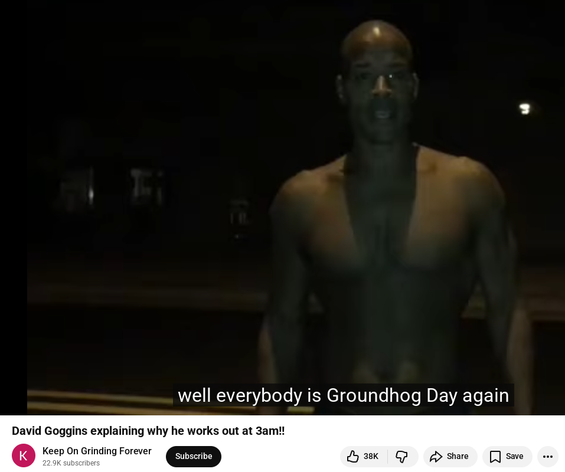
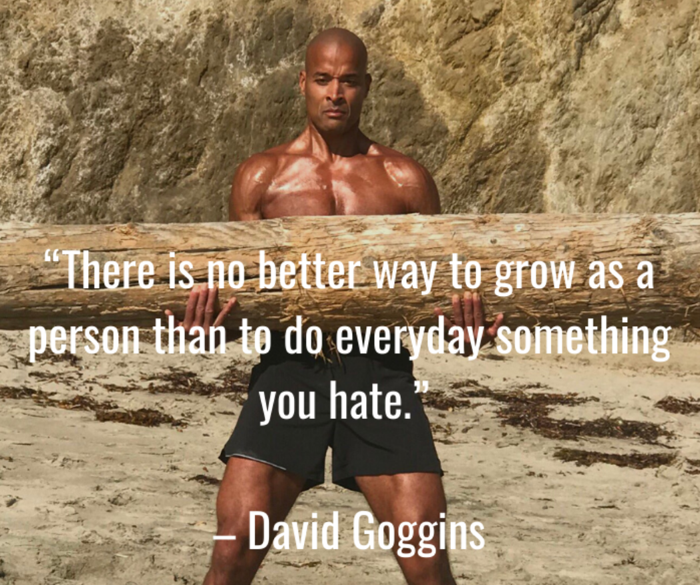

# Strategies to unwind addictions

In this tutorial we're going to explain strategies anyone can use to unwind addictions. We're going to assume that you have an addiction that is really difficult to quit, for example let's say heroin, meth, porn, social media, video games, etc.


Addiction is essentially running in circles, you are not going anywhere. At first when an addiction begins, it is easy to recognize it as such and to unwind it due to how small the circles you're doing:


However when an addiction has been going on untreated for years and years, **the downward spiral may be so huge that it feels like you're walking straight, despite being trapped in said compulsive behavior**:


When that is the case, maintaining an iron will using opus nihil may not be enough, you're going to need every little support you can get to effectively unwind the addiction

## Strategy 1: Logically recognizing the addiction as a waste of time

For me, my addiction used to be video games. I've been down that rabbithole for so long without even wanting to stop it that the spiral was truly gigantic.

If you want to stop an addiction, you need to recognize it as such. **To do that, ask yourself why you are doing things.** Just like what we explained in our [previous tutorial](../rightthing/index.md).


To lead a fulfilling life, you need to genuinely act to better the world. 

**So if you're spending your life producing absolutely nothing of value for the world, you're most likely trapped in an addiction cycle.**

Yes, you ARE an addict if you spend your days watching netflix, youtube, porn, smoking drugs, binging movies, social media, shopping, playing video games, etc. There's no grand reason you're engaging in these activities, since **you are effectively producing nothing of value** 

It's not easy to find your true purpose, i get that. But you should strive to find it, and once you're beyond certain that you'd be bettering the world by doing that activity, you should pour your whole life into it, **because that's where your life fulfillment truly is.**

So first of all, logically think it through. Ask yourself why you are doing it, and arrive at the conclusion that the given activity is not worth pursuing. **It can be because you're either wasting the limited amount of time you have on this planet, or simply because you're slowly killing yourself doing it.** 

Either reason should kept in mind throughout.

## Strategy 2: Rejecting the Idea itself

As we [previously explained](../opus-nihil/index.md), the Opus Nihil mantra is the first and foremost defense you have to unwind addictions. **Your thoughts should reflect those of satiety and fulfillment, not those of desperation**


I've been through this aswell, at any point in time while awake, remain attentive to your thoughts. **The addiction cycle always starts as a thought, an idea, a justification**, you must get good at spotting the thought and stopping it RIGHT THERE, before the ritual even begins. 

```
- Just one more time won't hurt
- Nobody's there, i can do X now
- What if i did X ?
- How about doing X ?
- I've had a bad day, i deserve to do X now.
- I really deserve X now, i've had enough.
- It would be awesome if X
- I want to do X
- I need to do X
```
**ALL of those thoughts are signals that you need to mentally utter the Opus Nihil mantra, and i don't care if you have to do that mantra every minute for an entire day, JUST DO IT.**

```
OPUS NIHIL MANTRA:
I want nothing (inhalation)
I need nothing (exhalation)
```

This is meant to train your mind REJECT the idea that you either want or need to indulge. 

This is about setting up the intent, **by uttering this mantra, you are rejecting the possibility of indulging.** 


**At first you may not be used to doing that, but you have to put in the effort directly from your mind**. 

You have to get better and better at this, because without self-control you'll never be able to stop the addiction. Think of it like lifting weights, at first it's hard to lift 50 kg at once, but if you keep lifting often, at some point you'll be able to lift 100kgs. It's just a matter of practice, and getting used to it.


The ability to reject thoughts and ideas is an essential brain muscle to your mental health. **The better you get at it, the more you'll be able to slow down the addiction, and with enough practice you'll be able to put an end to it.**

## Strategy 2: Procrastinating addictions and coming up with Excuses

If you try to beat an addiction by doing absolutely nothing, you're going to realize that it's very hardcore.

You NEED to remain relatively busy when trying to beat an addiction, and replacing your addiction with another activity is a good way of always giving yourself reasons to NOT do it.

For example let's say you feel the urge to take a drug, **you could come up with the excuse that you need to contribute to a project right now because it's urgent that said feature is implemented ASAP.** 


But really any reason is a good reason to replace the thought of indulging in an addiction with something else.

- I can't do X, because i need to do Y instead
- I can't do X, because i want to do Z instead

**It's like when someone asks you to do something every 10 minutes and you tell them "i'll do it in 10 minutes" each time**, here instead you find excuses to not indulge basically, and if you can successfully shift your thoughts from indulging to another healthier activity, it's still a step in the good direction.


## Strategy 3: Slowing it down is also progress

Keep in mind that **it's very important that you don't beat yourself up for indulging in the addiction.** If you give in to shaming yourself for having indulged into it, you're going to give yourself a reason to repeat it. **Don't do that.**

Failure is part of the process, It's okay to have a few bumps on such a long road, the only thing that matters is that you're going in the right direction.


Let's say that you are at your lowest point right now, Indulging in your addiction 3 times a day, see if you can slow it down to 2 times per day tomorrow.

**The next day, you managed to slow it down to 2 times per day, There's no shame to be had here, that's still progress.**

The next day you managed to slow it down to indulging only once per day, no shame to be had there either, that's also progress.

From there you must strive to slow it down further, indulging only once every 2 days, then once every 4 days, then once every 7 days. **Here the important part is that you integrate Strategy 2 well enough, that you can manage to keep yourself busy an entire day, without having time to indulge in any addiction whatsoever.**

If you manage to get yourself to space it out to 14 days you'll be able to implement the next strategy 4:


## Strategy 4: Make it hard to obtain it

If you're at this stage where you can resist the addiction for 14 days, this means that you've overcome the hardest part of it, that's when you should **irreversibly get rid of it.** 


Burn it, flush it down the toilet, throw it down a volcano. **It has to be irreversible**, the very possibility of retrieving it must not be there anymore.

It can also be in the form of destroying what you need to access it, for example erasing the user and passwords you stored on keepass to access the DNM to buy the substances.

The very possibility of obtaining it again must be as hard as possible, even if you were to try your hardest to get it.

However if the addiction is digital in nature, like for example accessing adult sites, i recommend trying to block the related websites on the VPN + DNS level like so:


While it can be disabled if you want to, it still makes it harder to access, so in case if you're too tempted, you'll have more time to realize that you're going in the wrong direction.

## Strategy 5: The "1 week effort" mindset

Now a common mistake you can mentally make after irreversibly making it harder to indulge is to think: **I PROMISE, NEVER AGAIN, I QUIT FOREVER!**

Your mind is not able to comprehend the enormity of forever, it's boundless so mentally uttering it would mean that you're READY to fully abandon an addiction.

If at the slightest wrong move you were to slip back into it and relapse, you'd feel ashamed of having broken your promise **and that lead yourself back to self-shame, you'd give yourself a reason to give up and indulge into it again. Don't do that.**

That's why you need to keep in mind a short timeframe, something that you can actually see yourself achieve.


One week is a good enough timeframe for most people. Let's say you manage to keep yourself busy for the whole week, and when the next week begins you AGAIN mentally decide to not indulge this week either.

**Essentially you promise yourself to stick true to your "1 week" promise every week.** If you can succeed twice in a row, that'd mean that you'd have been addiction free for 2 weeks straight. And you keep going at it for as long as possible.

```
-Week 1: Hard to get through, high alert to not indulge
-Week 2: Less hard to get through, high alert to not indulge
-Week 3: Doable to get through, but need to stay vigilant to not indulge still
-Week 4: Easier to get through, but need to stay vigilant to not indulge either
-Week 5: Easy to get through, BUT YOU MAY FORGET TO REMAIN VIGILANT AND RELAPSE!
-Week 6: Easy to get through, BUT YOU MAY FORGET TO REMAIN VIGILANT AND RELAPSE!
```
As time goes on and you manage to get through the weeks, you'll realize that it gets easier and easier to resist the addiction. 

But the trick is that if the addiction was strong for a long time, if it can't get to you through the front door, it'll also try to get through the windows, through the back door, through the roof, etc. 


YOU NEED TO STAY VIGILANT. While you are in the heat of unwinding your addictions you may be on high alert and remain focused, but when times are better again in the later weeks of you being addiction-free, **you should consolidate your satiety as much as possible by doing Opus Nihil even when there's no reason to do it.** 

It will help cement this idea that you don't need or want anything, and keep your mind in shape so to speak. **That way you remain ready for the unexpected moment the idea of indulging in the addiction appears again, months later.**

Always remain ready to reject the thought of indulging, as it may still appear at random 3 months later, 8 months later, 2 years later, etc. Stay in shape!

## Strategy 6: Consolidating Discipline

So life is good again, you managed to stay free of addictions for months at this point. Do you begin slacking off on the couch again ? Do you take your new life for granted ? Do you give in to laziness again ?



Fuck no. **You're going to wake up at 6 AM and go into an [ice-cold shower.](../coldshowers/index.md)**

No excuses. No whining. No "i'll do it tomorrow". No "not today". There are no days off. There's no avoiding it. There's no escaping it.

**"I don't want to" is NOT an excuse.** You do it when you want it, and you also do it when you don't want it. This is how you must start the day, with a battle, and a victory.

Today's a Saturday, it's the apocalypse out there, the blizzard is going strong, minus 50 degrees outside, you had a long day of work yesterday chopping logs, your wife just filed in for divorce, your pet dog died freezing outside, you just lost all your crypto in a dumb bet on wall street, north korea just sent nukes onto washington and **No, you still don't have an excuse to skip that morning ice-cold shower.**

**You still wake up at 6 AM and you go into that god damn arctic circle of a shower anyway.** Because that's where you're not only building yourself, but you're also destroying your weak self.

In that cold you're cementing the foundation, investing in yourself, becoming thougher, you go in there because you want to make a statement. You're not letting this weak you decide. You're telling that weak self to go suck it up and man up, with a daily reminder.



Now you got the message i'm sure, **it's about shifting your thinking from doing what you want to do, to doing what you don't want to do.** The simple way of achieving it is as explained above; Wake up at the same hour everyday, and first thing you do in the morning is step into the coldest shower you can withstand. 

Of course nobody, at first in their right mind wants to do that. But that's the point. Hidden behind the discomfort of that cold exposure are 3 rewards: 
- doubling your mental energy baseline for the day, 
- training your body to generate heat. (making your brown fat more dense)
- overcoming your first challenge of the day, and being victorious at it.


**Willingly stepping into the discomfort, as that's where you learn to put that "i want" or "i need" aside.** That's what you were missing when you started spiraling down the addiction in the first place right ?

[Realize that you don't truly want, nor need anything.](../opus-nihil/index.md)

Anything that the world needs you to do, you can start to do it right now. Today. 

The only one stopping you from doing what you were meant to do is this weak you. Put that weak self back in it's place everyday without fail.