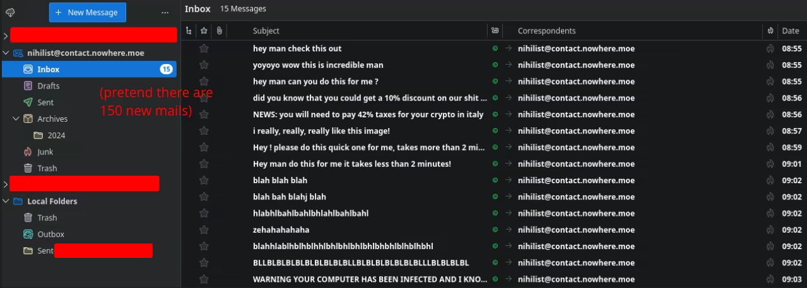
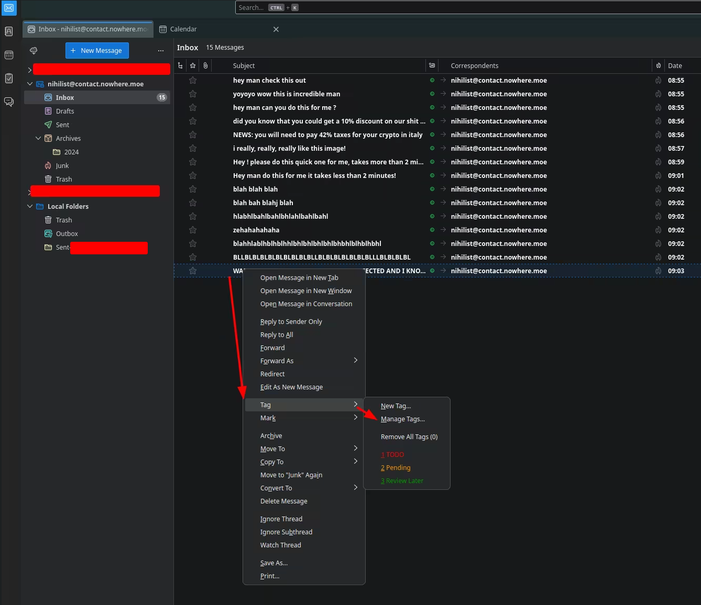
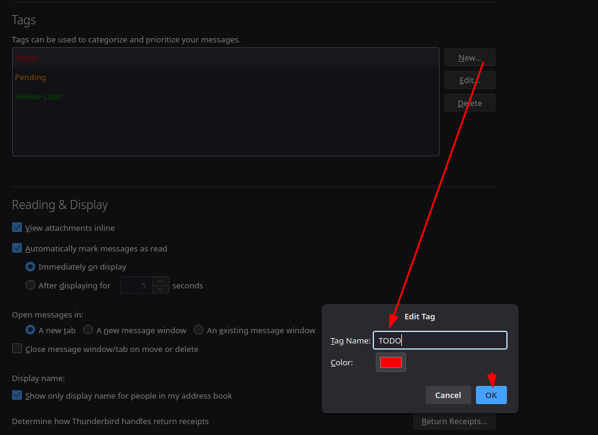
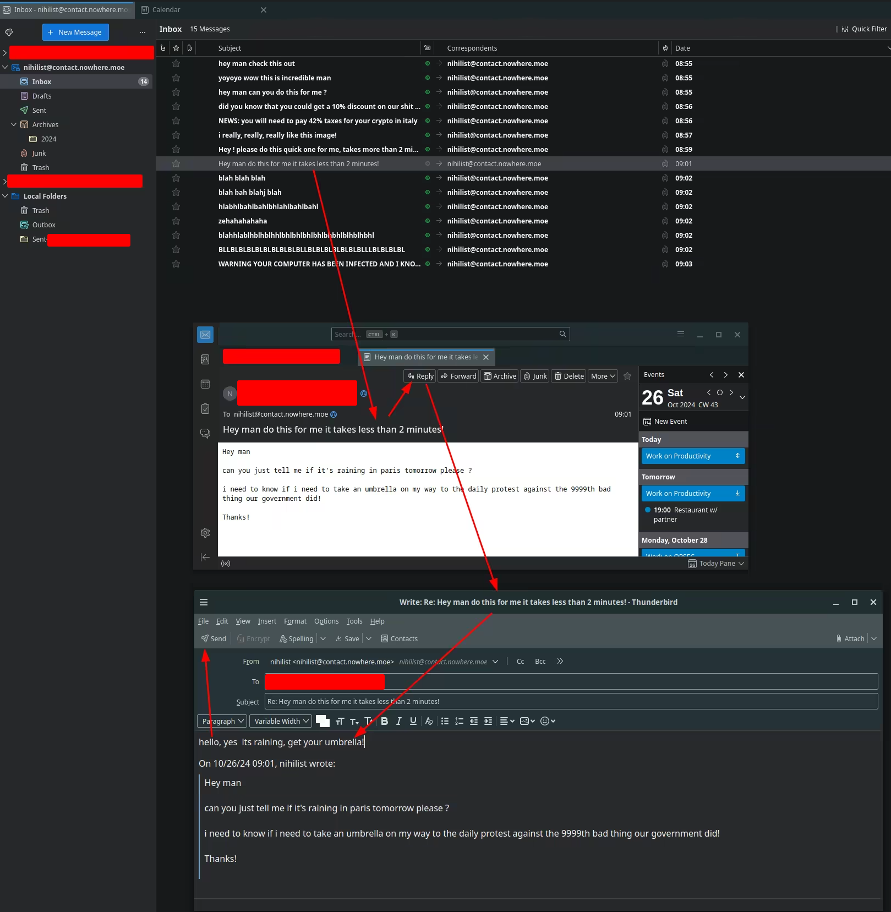
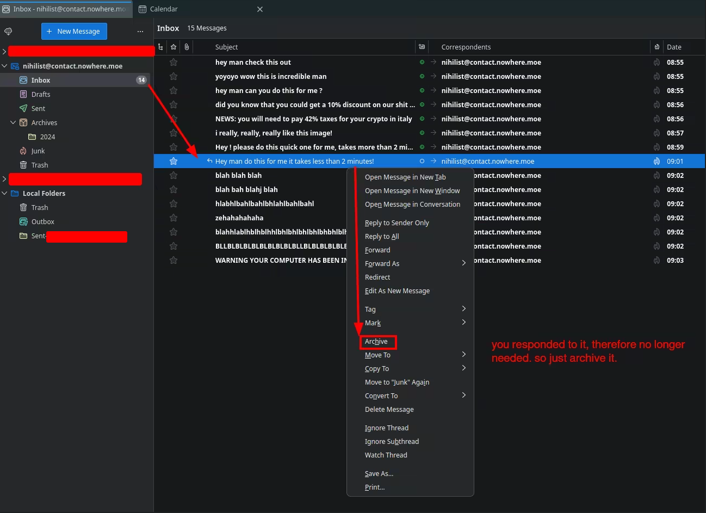
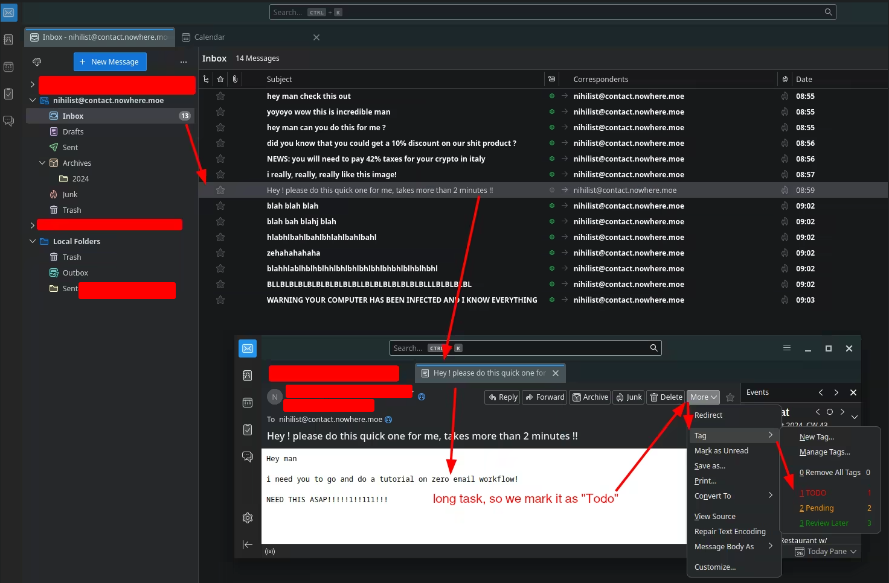
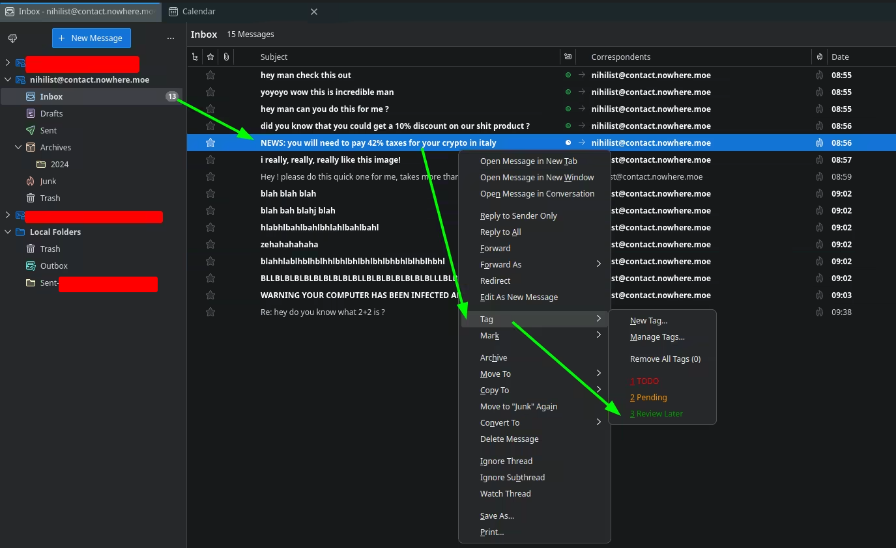
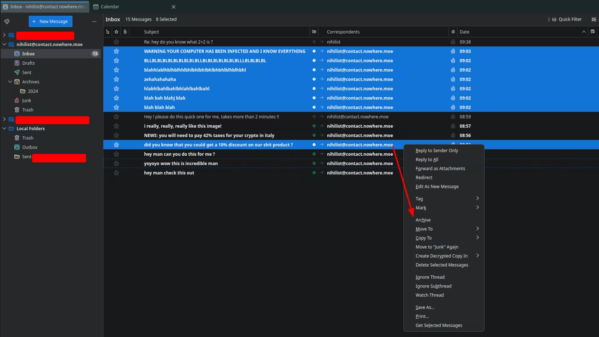
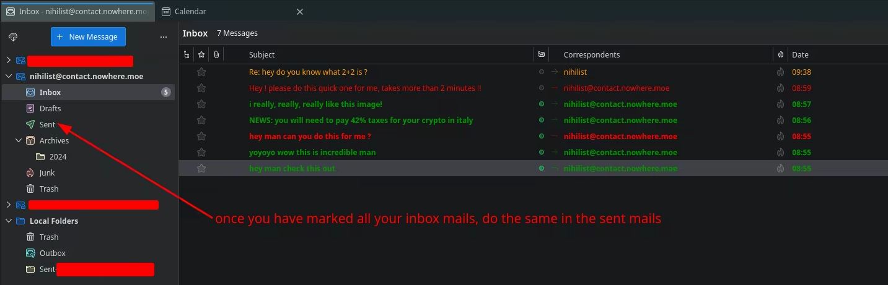
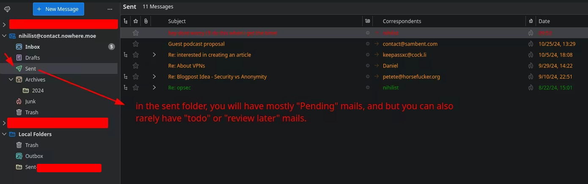

# Zero Email Workflow (in Thunderbird) 

## **Why is this important?**

Now while this may not be the case of everyone, but suppose you have a job in IT, where you get on average 75 mails per week. (and you're lucky because i get 150 per week at work), suppose you take a vacation for 2 weeks, and now you're back at work. but you see this:

Thing is, your emails are going to be an ever-growing pile of stuff if you don't take care of them properly, and the bigger it gets, the less you are going to want to even look at it. You need to keep it as small as possible, to be able to focus on the most important parts of it. Hence the need to have a clear workflow for your emails:

## **Zero Email Workflow explained**

So for each new mail that you either recieve or send, you need to ask yourself:

  1. Do i need it for later ?

  2. Am i waiting for someone else ?

  3. Does it take more than 2 minutes for me to action?

Depending on that, we will add labels to the mails themselves:

  1. **Label it green "review later"** if required for another time

  2. **Label it orange "pending"** if you are waiting for someone else to action it

  3. **Label it Red "Todo"** if it takes more than 2 minutes for you to action it

If the mail takes **less than 2 minutes**. for you to action it, just **respond to it immediately.**

And once a mail is no longer needed / if it got actionned / if you actionned it / if you responded to it, **you need to archive it** , so that it doesnt occupy any space in your mailbox anymore, and it doesn't potentially distract you from the mails that matter the most.

## **How to implement it in Thunderbird**

The first thing you need to do is create the labels in thunderbird:

 

once they are all created, you can start labeling mails (of course you need to read them first), so you open one (in this example its for us to action it, and it is a quick action):

so we just respond to it, and since the mail got responded to, we archive it:

In this next example it will be a something for us to action, but it takes more than 2 minutes to action. **So we mark it as "Todo"** :

In the next example we are waiting for someone to respond to us on something, **so we are tagging it as "Pending"** :

In the next example we are neither required to do anything, nor waiting for someone to do something, we are simply keeping a mail to review later when we get the time, **meaning we mark it as "review later"** : 

And then as you probably guessed we recieved alot of spam, so to select them in one go we can either do **"CTRL + LEFT CLICK"** or **"SHIFT + LEFT CLICK"** to select more than one at a time, to archive them.

Once all emails are marked properly, you have this result, with visual cues as to what you are waiting for, what you need to do, and what you need to review later:

And now we do the same but from the Sent folder:

And that's it! Now all that's left is for you to action the mails you marked in red, respond to them and archive them, or get a response for the ones marked in yellow, and archive them, or no longer need the ones in green and archive them. That way you'll highlight the important topics you need to tackle on priority from your mailbox, and get rid of the ones that are no longer relevant.

